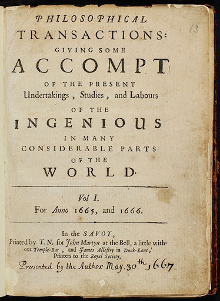
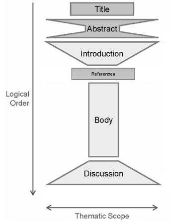

name: inverse
layout: true
class: center, middle, inverse
---

# Academic Methodologies

### Prof. Dr. Lena Gieseke | l.gieseke@filmuniversitaet.de  

#### Film University Babelsberg KONRAD WOLF

---

# Master Thesis Preparation!

---
layout: false

.center[ .imgref[[[tes]](https://www.tes.com/lessons/t7r8HisPgaaW0A/flying-pigs)]]

---

.center[ .imgref[[[imgur]](https://imgur.com/gallery/ex4PAUZ)]]

???
.task[COMMENT:]  

* Adam Savage is an American special effects designer, actor, educator, and television personality. He is best known as the co-host of the popular television series "MythBusters," which aired on the Discovery Channel from 2003 to 2016. Alongside Jamie Hyneman, Savage tested the validity of various myths, urban legends, and popular misconceptions through scientific methods and experimentation.

---

.center[ .imgref[[[wikipedia]](https://en.wikipedia.org/wiki/Journal_des_s%C3%A7avans#/media/File:1665_journal_des_scavans_title.jpg)]  .imgref[[[wikipedia]](https://en.wikipedia.org/wiki/Philosophical_Transactions_of_the_Royal_Society#/media/File:Philosophical_Transactions_Volume_1_frontispiece.jpg)]]

---
## Topics

--
.left-even[
* Conference Simulation 
* Literature            
* Anatomy of a Paper      

]

---
## Topics

.left-even[
* Conference Simulation 
* Literature            
* Anatomy of a Paper      

Fokus: Your Paper!
]

--

.right-even[
* Research              
* Reasoning             
* HCI                   
* Experiments           
* Statistics            
* Qualitative Research  
* Academic Publishing   
* Academic Careers      

New: Artistic Research, Media Studies
]

---
## Topics

> The ability to conceptualize and contextualize discourse, critical reflection and academic work.

???

> § 6 (3) Der wissenschaftliche Teil der Masterarbeit (16 LP) soll belegen, dass die/der Studierende die Fähigkeit zum **konzeptionellen und kontextualisierenden Diskurs, zur kritischen Reflexion und zur wissenschaftlichen Arbeit** besitzt. Der **Inhalt soll sich auf den praktischen Teil der Masterarbeit beziehen**.

---
## Today

--
* ACS FUB

--
* Course setup

--
* Anatomy of a Paper

--
* Literature

---
template:inverse

### Academic Conference Simulation at the Film University Babelsberg KONRAD WOLF

# ACS FUB

???
.task[COMMENT:]  

* The overall goal of this lecture is to help you to conduct your own research projects. Please keep in mind that we will start small with your projects and papers. 

---
## ACS FUB 2025

--
* Practical exercise for academic writing (your master thesis)

--
* Replication of a typical process of submitting a research paper

--
* Application of the lecture topics

--

The simulation includes

--
* The submission of a (short-) paper

--
* Writing and receiving reviews

--
* The presentation of your work in front of your peers

--
* A best paper award

---
.header[ACS FUB 2025]

## The Paper

--
* Must adhere to an academic format
    * E.g. introduction, contributions, related work, problem statement, solution, future work)
--
* Must tell an "academic story"

---
.header[ACS FUB 2025 | The Paper]

## Topic

--
* Any topic of your choice within the field of Creative Technologies

--
* The research itself does not need to be a new task

--
* The paper can relate to your 1st term project, Bachelor thesis, or any other already existing project

???
.task[COMMENT:]  

* I highly recommend to try to come up with a topic in the context of your 1st term project as you have already put in a lot of thought and effort into it and it might have a greater chance of publication with an accompanying practical implementation. There are plenty of more practical and / or artistic oriented venues.

--
    * The paper must include a substantial amount of original writing
    * You can not re-use a short-paper
    * You can not re-use something that is already published

---
.header[ACS FUB 2025 | The Paper]

## ChatGPT & Co.

* You are allowed to use any tool you want

--

> What do you want to learn with this class? 
  

???
* I personally recommend that in this class you stay away from any AI writing help for now.

---
.header[ACS FUB 2025 | The Paper]

## Format

The paper must follow the format guidelines otherwise it is not accepted.

--
* 4-6 pages (without references)
* In English
* Abstract of <= 1000 characters
* Written with the given LaTeX Template

--

Submission

* As pdf
* Through the conference management system EasyChair

???
.task[COMMENT:]  

* https://easychair.org/conferences/submissions?a=26977916

---
.header[ACS FUB 2025]

## Reviews

--
* You will write and receive two reviews for your paper from your fellow students

--
* Reviews evaluate the content but also form and language of your paper

--
* There will be a review template

--
* If there are revision requests, these must be worked in for the final version of the paper

---
.header[ACS FUB 2025]

## Reviews

* Originality
* Clarity of presentation
* Technical and/or methodological soundness
* Importance, utility
* Completeness of references
* Best paper award

---
.header[ACS FUB 2025]

## Deadlines

--
All deadlines (all dates 20:00 GMT) are hard. Late submissions are not accepted.

--
* 08.09.25: Abstract Due
* 12.09.25: Paper Due
* 15.09.25: Review Start
* 30.09.25: Review Due
* tba: Author Notification
* tba: Conference

--

Unfortunately deadline extensions due to illness will be difficult. If you get sick close to the deadline, please get in touch with me asap.

---
template: inverse

# Course Setup

???
.task[COMMENT:]  

* [text](https://github.com/ctechfilmuniversity/lecture_ss25_academic_methodologies)

---
template: inverse

# Methodology

???
* Why is this course called academic methodologies?

ASK: Method vs. Methodology
Method
* Various procedures, schemes, algorithms, etc.
* Planned, scientific and value-neutral

Methodology
* A science of studying how research is to be carried out
* Study of methods by which knowledge is gained.
* Its aim is to give the work plan of research.
    * Systematic way to solve a problem

---

## Methodology

We are aiming for a deeper understanding in academia and need to not only execute research but also explain it. 

 

--

For example, in the *motivation*, *discussion* and *evaluation* sections of a publication.  

---
.header[Research]

## Methodology

You will need to answer questions, such as:

--
* Why is a particular research study undertaken?

--
* How did you formulate the research problem?

--
* How are you solving the problem and why is that a suitable approach?

--
* What type of literature / data did you collect, why?

--
* What particular methods have been used, why?

--
* How do you validate your methods?

--
* How do you validate your insights and results?

???
.task[COMMENT:]  

* Consideration of these aspects constitute a research methodology. Ideally, you are able to answer these questions before you start your actual research work.

* For example, not only know how to calculate the mean, variance and distribution of a data set but also know why these functions give meaningful results for the chosen problem. Is e.g. the mean at all representative for the data set?

---
template: inverse

# Anatomy of a Paper

---
template:inverse

#### Anatomy of a Paper

# The Leitmotif

---
## The Leitmotif

You can understand the leitmotif as guide for building a *narrative flow*.

--
* Here is a problem

--
* It is an interesting problem

--
* It is an unsolved problem

--
* Here is my idea

--
* My idea works

--

You are telling the story about your idea, everything in the paper must serve the storyline.

???
.task[COMMENT:]  

* You want to infect the mind of your reader with your idea and for that you need to come up with *this one shiny idea*, which can be different from the contributions. Make sure the reader knows what the idea is and make the reader care about your idea, e.g. by clearly pointing out that the paper will generate a *reusable insight*, which will be useful to the reader. Try to give the readers something they didn’t have before. 

---
## The Leitmotif

You can understand the leitmotif as guide for building a *narrative flow*.

* Here is a storyline
* It is an interesting storyline
* It is an original storyline
* Here is my story
* This story is reasonable because...

--

Everything in the paper must serve the storyline.

???
.task[COMMENT:]  

* You want to infect the mind of your reader with your idea and for that you need to come up with *this one shiny idea*, which can be different from the contributions. Make sure the reader knows what the idea is and make the reader care about your idea, e.g. by clearly pointing out that the paper will generate a *reusable insight*, which will be useful to the reader. Try to give the readers something they didn’t have before. 

---
template:inverse

#### Anatomy of a Paper

# Paper Sections

---

.center[].imgref[[[derntl]](http://dbis.rwth-aachen.de/~derntl/papers/misc/paperwriting.pdf)]

???
.task[COMMENT:]  

* Any academic writing follows overall this structure:

---
## Paper Sections

The structure of a paper is as follows:

--
* Title

--
* Teaser Image (if possible)

--
* Abstract

--
* Introduction

--
* Related Work

--
* Main Content

???
.task[COMMENT:]  

* Algorithm, Setup, Study, etc.
* Results
* Evaluation
* Discussion

--
* Future Work

--
* Conclusion

--
* Acknowledgements

???
.task[COMMENT:]  

* In the context of computer science almost all paper follow the same structure, with minor differences in the structure of subsections and in the specific section titles.

---
.header[Paper Sections]

## The Introduction

???

A chance of making a positive impression: writing style, overall quality, analytical skills, confidence in ideas, dramaturgy.

Last chance of making the reader want to read your paper in detail.

---
.header[Paper Sections]

## The Introduction

More details regarding the motivation and problem statement:

--
* From general to specific
    * “Zooming in…”
--
* Supported by concrete examples, questions, mysteries
* Contextualizing the problem
    * Importance of the problem
--
* Overview of proposed approach  

???

* List of contributions
    * You can merge an outline of the paper into this  
  
---
.header[Paper Sections]

## The Introduction
  
The introduction makes claims...  
  
--

 
  
...the body of the paper provides evidence to support each claim.

---
.header[Paper Sections]

## Related Work

--

> In a paper these are works with a similar research questions / storyline.

--

* It is not about explaining the needed knowledge

???
* Example survey - what is the related work.

---
.header[Paper Sections]

## Related Work

When writing about the related work, you have two competing goals:

--
1. Show that you are working on a ‘hot topic’ with a lot of related work.

--
2. Show that, and why you are different to all of them.

???
  
In the sciences the related work comes after the introduction.

---
.header[Paper Sections]

## Related Work

--
* Broad and shallow account of the field

--
* Helps to place the contribution / storyline of the paper in context
    * What are the ‘rival’ approaches?
    * What are the drawbacks of each?
    * How have the different approaches progressed?
    * What are the major outstanding problems? 
--
* Section is also often structured based on applied techniques/ideas

--
* Usually 1-2 sentenced for one idea/paper

---
.header[Paper Sections]

## Related Work

--
* Distinguish your work: **How are you different?**

--
* Motivate your work: Why is your extension important?

--
* Comparison of results

--

Never make other people’s work look bad!

???
.task[COMMENT:]  

* With this section you need to clearly distinguish your work and answer the question of how you are different from everybody else. At the same time the related work is not about describing your own work. It is once again a balancing act to compare your work and make it stand out without really getting into the details of your approach.
* The standard within most research communities is to never make other people’s work look bad. You never openly criticize a paper in your related work section even if you might think the other paper is rubbish. Critical discussions usually happen during conferences in person. Equally, it is common practice to be quite generous in your statements. Giving credit to others will not diminish your contributions and it might help to show the relevance of your work. It is common to say something like “In the inspiring paper…”, for example.

## Related Work

Reviewers carefully check the related work section!

* Missing related work is the first step towards rejection
* Claiming something that is not yours is the first step towards unemployment

Reviewers carefully check or just know out of the top of their heads as they are chosen as experts in the field, if the related work is complete. Missing related work is the first step towards rejection and claiming something that is not yours is the first step towards unemployment.

The correct tense can be tricky: algorithms, techniques, etc. are still valid and must be in present tense. But e.g. the topic was introduced or studies are done in the past.

* Related work is not just a list of summaries.
    * List not only just what what was done but also why?, why not?, how?, how else? 
 

---
.header[Paper Sections | Related Work]

## Example

> […] None of the work discussed so far integrates artist control on an element and connection level once the pattern is computed. There are procedural techniques that enable low-level control on the results themselves, developed in the context of architectural designs [LWW08], tree modeling [PSK∗12] and the creation of natural scenes [EVC∗15]. The move operator from the latter is similar to ours but their system is optimized for chaotic arrangements, which contrasts to our organized design goals for ornaments. 

---
.header[Paper Sections]

## Main Content

--

The goal is to provide evidence for your claims!  
  

???
.task[COMMENT:]  

* The main content must provide all evidence for your claims. Make sure the overall idea of your project is completely clear before going into details. For the structure of the sections do not recapitulate your personal journey of discovery. The report order is usually different from the order of the investigation. Choose the most direct route to the idea. 

Do not recapitulate your personal journey of discovery, the order of investigation is usually not a suitable structure.

---
.header[Paper Sections]

## Main Content

The structure of the main content depends on the type of problem and solution.
  
In one form or the other the main content must include:

--
* Theory

???
.task[COMMENT:]  

* Describe the underlying theory of techniques or the system.
* Where appropriate, use a mathematical style of definitions, theorems, …

--
* Specifications

???
.task[COMMENT:]  

* Formally specify techniques that underlie the implementation.
* State the *requirements* of the implementation. Are there any constraints for it to work?
* Describe any assumptions you might make, any needed input data, etc.

--
* Implementation / Method / Case Study / ...

???
.task[COMMENT:]  

* Consider a figure for the pipeline/method.
* Describe only the final state of the implementation.
* Identify the major design decisions and give their reasons.
* Describe the overall structure of the system and key algorithms in abstract form.
* Illustrate the main algorithms with simple but meaningful examples.

--
* Result

--
* Evaluation

--
* Discussion

--

Overall treat the main content as if explaining your work with a whiteboard.

???
.task[COMMENT:]  

* Conveying an intuition is primary and once the readers have the intuition, they can follow the details. Of course, you can use formalisms and formulas but don’t hide behind it. Carefully balance between showing that you know stuff and being pompous. Don't forget to introduce notations and terminologies first wherever required.

### Figures

Well understandable papers, no matter the complexity of their work, make extensive use of figures such as diagrams, a system overview and visual explanations (in all sections, not just in the main content). All figures must be tied into the text and must be referenced in the text at least once. For good venues the quality of figures is very high, going as far as research teams hiring professional designers. A good figure has a clean layout and is ideally understandable on its own. If that is not possible (and often it is simply so) it must be understandable with the caption though. Captions are allowed to be a bit longer and need to put the figure into the context of the project and need to give all details needed to understand the figure. Remember, when reading a paper, it is common to make a first pass just by looking at the figures and reading the captions.

If a figure is not by you, you must properly cite it. For publication you must have the correct copyrights for any image you use. The publication venue will make you sign that you have all necessary rights. 

*On a Side Note*: My way of giving credits for the used images in my scripts does not match any academic format but it is my own style 😎. As you are reading the scripts online and I provide links as reference, I think it is still a valid representation. Also, copyrights are overall different in an educational context. But in any more official context than lecture scripts my reference style is incorrect! 

## Results

Collect a broad spectrum of possible results.

* Results might have already be referenced when describing the technique

* Careful balance result quality
    * An overview of *possible* results not just the best ones

* The presentation of your results must collect a broad spectrum of *possible* results not just the best ones. Be careful here to balance result quality. You need to show some convincing drawbacks or issues as nothing is ever perfect but of course you also don't want to unnecessarily highlight issues. It is completely fine to reference the results in a previous section, e.g. when describing the technique.

## Evaluation

Describe your evaluation technique

* Reason why it is valid
* Try to use as many objective measurements as possible
    * Benchmarks, performance, error count
* You can mix approaches, e.g. measurements and a user study

* You must in one form or the other evaluate your results. Clearly describe your evaluation technique and give reasons why it is valid. Try to use as many objective measurements as possible such as benchmarks, performance, error count. If you can, compare your work with these with the results of other projects. 
* The evaluation can go as far as conducting a formal study, a survey, interviews, etc. Depending on the scope and size of the evaluation it is common to entitle the evaluation itself as a contribution of the paper.

---
.header[Paper Sections]

## Discussion

--

As detailed and openly as possible, you should have nothing to hide.

???
* Don’t state the obvious

--
* Interpret your results
    * Explain/mention everything that is noticeable in your results and evaluations
    * Outliers, strange behaviors, …
--
* Is the evaluation correct?

--
* Anticipate possible questions from the reviewers!

???
.task[COMMENT:]  

* The discussion is usually the hardest to write as you need to generated insights that go beyond the execution of your research project. This might not come naturally and needs a lot of brain power. A good start to discussing your work is to try to anticipate what reviewers/advisors might say and answer to that. Explain or mention everything that is noticeable in your results and evaluations. Are there any outliers, strange behaviors, etc.? Is the evaluation correct?

Reflect on the project as detailed and openly as possible - in regard to both, the good and the bad. Ideally you have nothing to hide. Again, no one expects a perfect project and also some drawbacks can give valuable novel insights.

---
.header[Paper Sections]

## Discussion

Might already start to zoom out by discussing how the presented work is generalizable, application scenarios, and its impact.

???
.task[COMMENT:]  

* and what its different applications are. Here, you can also describe what overall impact the project might have.

---
.header[Paper Sections]

## Discussion

Might not come naturally, needs a lot of brain power!

---
.header[Paper Sections]

## Future Work / Outlook

Again, try to anticipate what what reviewers might say.

--
* Which improvements are possible?
* How to generalize the work?
  
--
  
Do not state anything you want to write the next paper about.

???
.task[COMMENT:]  

* The future work section is somewhat flexible. You should include it but it can also be integrated into the discussion or even conclusion. Sometimes this section is also called outlook. Again, try to anticipate what reviewers might say, e.g. "why didn't you try/do...?" and here you can brush that of as describing it as next step.
* Overall think about which improvements are possible and how to generalize the work. Do not however state to clearly anything you want to write the next paper about as then other researchers might do it for you...

---

## Paper Sections

Remember, the storyline of the paper goes 

--
* Abstract → Introduction → Details
    * Journey from general to specific
--
* Details → Conclusions
    * Return journey from specific to general

---

.center[].imgref[[[derntl]](http://dbis.rwth-aachen.de/~derntl/papers/misc/paperwriting.pdf)]

---
template:inverse

#### Your Paper
# Where to Start?

???
* In your brain...

---
## Research Question

--

.left-even[
.center[]

.footnote[Images left-right: [Chad Flinn](https://malat-webspace.royalroads.ca/rru0054/what-makes-a-good-research-question/), [Indiana Wesleyan Uni](https://indwes.libguides.com/c.php?g=71141&p=458447)]]

--

.right-even[
.center[]]

---
## Research Question

> A question that a research project sets out to answer.  
  
---
## Research Question

> An academic story that a you set out to tell in a structured manner.  
  

--
* Focus on a single problem

--
* As specific and narrow as possible

--
* Complex enough to develop the story over the space of a paper

--
* Feasible to answer within the time-frame and practical constraints

---
## Research Question 

> The research question is also the question why you should delight the world with another pile of printed paper.  
  
.caps[Winter, Wolfgang]. 2005. **Wissenschaftliche Arbeiten schreiben**. 2nd Ed. Frankfurt: Redline Wirtschaft.

???
.task[COMMENT:]  

* Description
    * What is the case? 
    * What does reality look like?
    * *What is...like?*
    * What is teacher training at university XYZ like? 
* Explanation
    * Cause-effect relationship: What are the consequences of an action? 
    * *Why do... differ?*
    * *Why ... changed ...?*
    * Why do companies differ in terms of staff development?
    * Why hasn’t labor mobility in the EU changed since 1990?
* Creation
    * Which measures are useful to solve a particular problem? 
    * *How can we...?*
    * *What strategies can...?*
    * How can we ensure population balance in the future?
    * What strategies can companies use to be successful in the Chinese market?
* Criticism/Evaluation
    * How can one condition be assessed in the light of specific criteria? 
    * *How can ... be assessed regarding to ...?*
    * *Are... more satisfied after...?*
    * How can pupil-centered teaching in English be assessed in the light of formal performance dimensions?
    * Are teachers more satisfied after having developed school profiles?
* Outlook
    * What will happen in the future? 
    * What kind of changes are to be expected? 
    * *How will ... change?*
    * How will staff development in a particular line of business change over time?
    * How will labor mobility in the EU change in the next 5 years?

???
.task[COMMENT:]  

* The problem relates to the relevance of the topic and is a larger unit of meaning (political, scientific, ethical, vocational problems, etc.). 
* You can never write about everything (that is, the whole problem), but only about one aspect of the problem – i.e., the research question. 
* It is the aim of your paper to introduce and apply theories, test new methods, interpret sources, etc. 

---
## Research Question

 Next, you need to narrow your research aims and make them specific.
  

---
## Research Question

*Describing and exploring*  
* What are the characteristics of X?
* How has X changed over time?      
* What are the main factors in X?   
* How does X experience Y?          
* How has X dealt with Y?           

---
## Research Question

*Explaining and testing*

* What is the relationship between X and Y?
* What is the role of X in Y?              
* What is the impact of X on Y?            
* How does X influence Y?                  
* What are the causes of X?                
* A theory on X               
* A concept of X               

---
## Research Question

*Evaluating and acting*

* What are the advantages and disadvantages of X?
* How effective is X?                            
* How can X be achieved?                         
* What strategies improve X?                     
* How can X be used in Y?                        
* State of the art of X                       

---
## Research Question

In my experience, the most common problems with student papers are:

--
* The question / storyline is **too general**

--
* The question includes **poorly defined** aspects

???
.task[COMMENT:]  

*  Unfocused and too broad: What are the effects of childhood obesity in the United States?
This question is so broad that research methodology would be very difficult. 
* More focused: How does childhood obesity correlate with academic performance in elementary school children?
This question has a very clear focus for which data can be collected, analyzed, and discussed.

---
## Your Paper

1. Find three topics you are interested in

--

.left-even[
.center[]

.footnote[Images left-right: [Chad Flinn](https://malat-webspace.royalroads.ca/rru0054/what-makes-a-good-research-question/), [Indiana Wesleyan Uni](https://indwes.libguides.com/c.php?g=71141&p=458447)]]

---
template:inverse

# Literature

???
.task[COMMENT:]  

* Searching
    * Engines
    * Digital Libraries
* Strategies
    * Searching
    * Collecting
    * Reading
* Management Tools
* Literature Surveys

---
.header[Literature]

## Search Engines

* Google Scholar
    * Best in terms of volume and being up-to-date
    * Shows you where to find the document
    * You can follow who cited that entry

--

* Search: [The top list of academic search engines](https://paperpile.com/g/academic-search-engines/), Search for "alternatives to google scholar", etc.

???
.task[COMMENT:]  

* Search for "alternatives for google scholar", e.g. with Research Gate coming up.

---
.header[Literature]

## Digital Libraries

Multiple disciplines:

* Springer Link
* Elsevier
* MIT Press Direct

???
https://direct.mit.edu/leon/issue

---
.header[Literature]

## Digital Libraries

HCI / Computer Science (all content is of fairly high quality):

* ACM Digital Library
* IEEE Xplore
* Eurographics Digital Library

???

* ACM Digital Library
    * Association for Computer Machinery
    * Computing society
* IEEE Xplore
    * Institute of Electrical and Electronic Engineers 
    * Technical professional organization dedicated to advancing technology
* Eurographics Digital Library
    * European Association for Computer Graphics

---
.header[Literature]

## Search Strategies

--
* Keywords

--
* Authors

--
* References in papers
    * Follow the citations in the paper
--
* Venues
    * Journals, conferences that fit topic-wise

--
> It is not an accomplishment to find literature. Reading the right one really is!

---
.header[Literature]

## Search Strategies

.center[]
  
.imgref[[[theshirtlist]](https://www.theshirtlist.com/down-the-rabbit-hole-t-shirt-2/)]

---
.header[Literature]

## Collection Strategies

--
.left-even[
* Set yourself a time frame

]
---
.header[Literature]

## Collection Strategies

.left-even[
* Set yourself a time frame
* Decide on the type of search, e.g.
    * broad vs. deep?
    * with certain keyword(s)
]

---
.header[Literature]

## Collection Strategies

.left-even[
* Set yourself a time frame
* Decide on the type of search, e.g.
    * broad vs. deep?
    * with certain keyword(s)
* Be disciplined with the search
]
--
.right-even[
* Have a setup 
    * Which references to save?
    * How, where and under which name to save?
    * How to come back to the reference (assign a prioritization)?
]

???
.task[COMMENT:]  

* Set yourself a time frame, otherwise hours over hours might just pass by.
* Decide on the type of serach you want to do: narrow vs. broad. What is it you want to archive with this search? Get an overview? Get specific related work for an algorithm?
* For a more narrow search, be disciplined about staying on track of certain keywords, for example.
* Maybe decide on a number of papers you want to save, which should be connected to the actual time you have to read them.
* Have a setup ready that decides
    * how to decide which papers to save,
    * how (pdf vs. online link?), where and under which name to save papers,
        * E.g. I save paper as `firstauthorlastname_year_firstlettersofthefirstthreewordsofthetitle.pdf`, such as `wong_1998_cgf.pdf`
    * wether to give them directly a prioritization on what to read next, and
    * how to make sure that you come back to these papers and actually read them.

---
.header[Literature]

## Collection Strategies

--
* Read the title

--
* Read the abstract

--
* Look for a list of contributions and if found read them

--
* Look at the figures one by one and read their captions

--
* Look at additional materials such as a project page or supplemental videos

--

> The more decisions you make about the reference right away, the more time you save later on.

???
.task[COMMENT:]  

* The more decisions you make about the paper right away (whether to save, read, read first, tags,... ?), the more time you save later on, when you have to once again remember what the paper was about and whether you should read it.

---
.header[Literature]

## Management Tools

A lot is happening - this script is probably out of date!

--

> Any suggestions?

---
.header[Literature | Management Tools]

## [unriddle](https://www.unriddle.ai/)

.center[  
.imgref[[[unriddle]](https://www.unriddle.ai/)]]

---
.header[Literature]

## Reading Strategies

Ideally, you should have a system, which tells you what to read next.  
  
For this also reading lists in a literature management tools can be helpful.

???
.task[COMMENT:]  

* Reading many papers makes you a better researcher
* Also across topics

---
.header[Literature]

## Reading Strategies

Read with intention

--
* *Why are you reading this paper?*

--
* *What is it that you want to know and gain from reading this paper?*

---
.header[Literature]

## Reading Strategies

???
.task[COMMENT:]  

* Homework readings

---
.header[Literature | Reading Strategies]

## The PQ4R Mthod

There are several "reading methods" out there, for example the PQ4R method:

--

* **P**review: Overview, scanning
* **Q**uestions: What do you want to know from the paper?
* **R**ead
* **R**eflect: Reflect arguments, are there counter arguments?
* **R**ecite: Be able to summarize content in your own words.
* **R**eview: Critical questioning of content.

---
template:inverse

#### Your Paper
# Topic Brainstorming

???
* 10 minutes afterwards share at least one

---
template:inverse

# Next

---
# Next

From topics to storylines...

--

.center[].imgref[[[phdcomics]](https://phdcomics.com/comics/archive.php?comicid=1436)]

---
template:inverse

### The End

# 👋🏻
