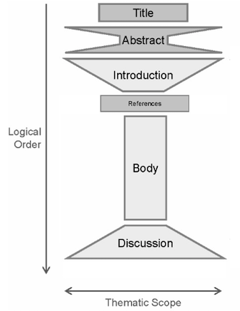
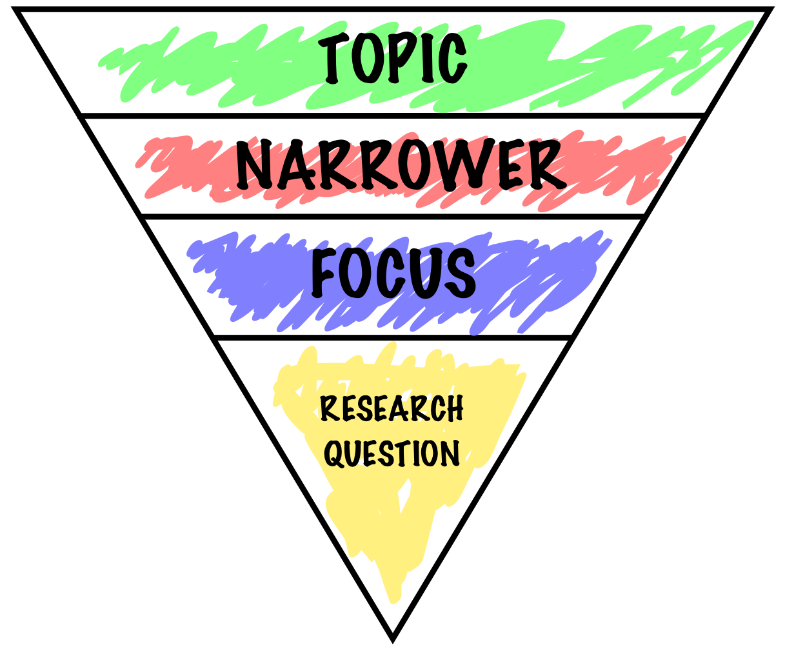
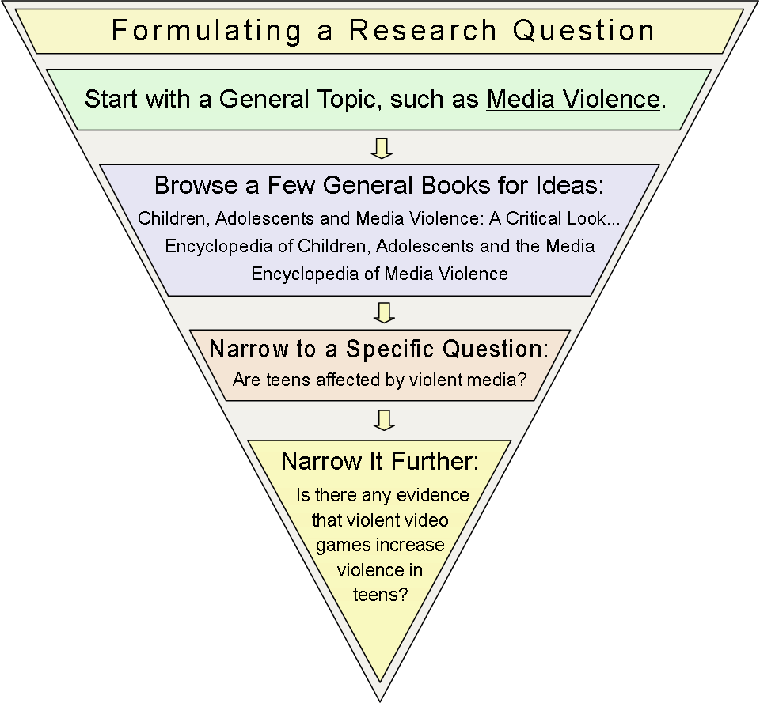
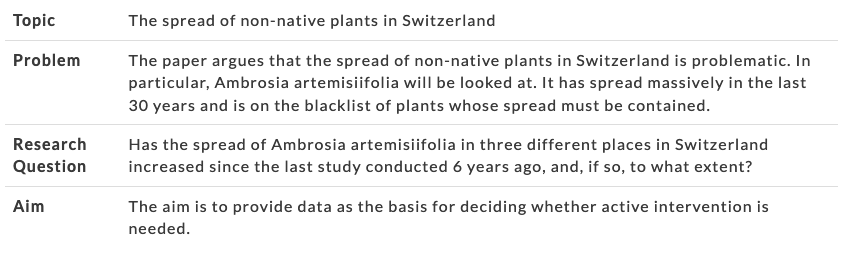
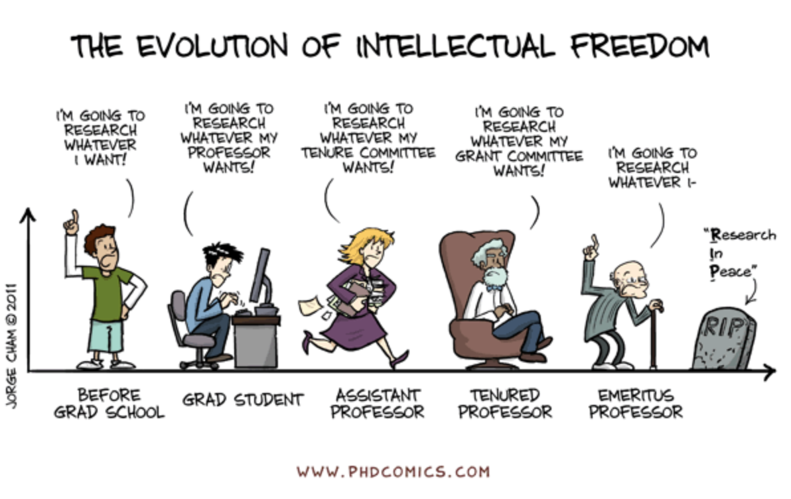

name: inverse
layout: true
class: center, middle, inverse
---

# Academic Methodologies

### Prof. Dr. Lena Gieseke | l.gieseke@filmuniversitaet.de  

#### Film University Babelsberg KONRAD WOLF

---
layout:false
## Today

--
* ACS FUB

--
* Literature
* Reading Strategies

--
* Anatomy of a Paper

--
* Paper Topics

---
## ACS FUB 2025

--

Requirements

* The submission of a (short-) paper
* Writing and receiving reviews
* The presentation of your work in front of your peers

---
.header[ACS FUB 2025]

## Deadlines

All deadlines (all dates 20:00 GMT) are hard. Late submissions are not accepted.

* 08.09.25: Abstract Due
* 12.09.25: Paper Due
* 15.09.25: Review Start
* 30.09.25: Review Due
* tba: Author Notification
* tba: Conference

Unfortunately deadline extensions due to illness will be difficult. 

???

If you get sick close to the deadline, please get in touch with me asap.

* Any questions regarding the overall course setup?

---
template:inverse

# Literature

???
    

* Searching
    * Engines
    * Digital Libraries
* Strategies
    * Searching
    * Collecting
    * Reading
* Management Tools
* Literature Surveys

---
.header[Literature]

## Search Strategies

--

* Keywords
* Authors
* References in papers
    * Follow the citations in the paper
* Venues
    * Journals, conferences that fit topic-wise

> It is not an accomplishment to find literature. Reading the right one really is!

---
.header[Literature]

## Collection Strategies

.left-even[
* Set yourself a time frame
* Decide on the type of search, e.g.
    * broad vs. deep?
    * with certain keyword(s)
* Be disciplined with the search
]

.right-even[
* Have a setup 
    * Which references to save?
    * How, where and under which name to save?
    * How to come back to the reference (assign a prioritization)?
]

???
    

* Set yourself a time frame, otherwise hours over hours might just pass by.
* Decide on the type of serach you want to do: narrow vs. broad. What is it you want to archive with this search? Get an overview? Get specific related work for an algorithm?
* For a more narrow search, be disciplined about staying on track of certain keywords, for example.
* Maybe decide on a number of papers you want to save, which should be connected to the actual time you have to read them.
* Have a setup ready that decides
    * how to decide which papers to save,
    * how (pdf vs. online link?), where and under which name to save papers,
        * E.g. I save paper as `firstauthorlastname_year_firstlettersofthefirstthreewordsofthetitle.pdf`, such as `wong_1998_cgf.pdf`
    * wether to give them directly a prioritization on what to read next, and
    * how to make sure that you come back to these papers and actually read them.

---
.header[Literature]

## Collection Strategies

--
* Read the title

--
* Read the abstract

--
* Look for a list of contributions (if applicable)

--
* Look at the figures one by one and carefully read their captions

--
* Look at additional materials such as a project page or supplemental videos

--

> The more decisions you make about the reference right away, the more time you save later on.

???
    

* The more decisions you make about the paper right away (whether to save, read, read first, tags,... ?), the more time you save later on, when you have to once again remember what the paper was about and whether you should read it.

---
.header[Literature]

## Management Tools

A lot is happening...

--

> Any suggestions?

--

What is your choice and why?

???
Ideally, you should have a system, which tells you what to read next.  
  
For this also reading lists in a literature management tools can be helpful.

* Reading many papers makes you a better researcher
* Also across topics

---
.header[Literature | Management Tools]

## [Anara](https://www.unriddle.ai/)

.center[  
.imgref[[[unriddle]](https://www.unriddle.ai/)]]

---
.header[Literature]

## Reading Strategies

---
.header[Literature]

## Reading Strategies

Read with intention:

--
* *Why are you reading this paper?*

--
* *What is it that you want to know and gain from reading this paper?*

---
.header[Literature]

## Reading Strategies

*What do the homework readings say?*

???
    

* Homework readings

---
.header[Literature | Reading Strategies]

## The PQ4R Method

There are several "reading methods" out there, for example the PQ4R method:

--

* **P**review: Overview, scanning
* **Q**uestions: What do you want to know from the paper?
* **R**ead
* **R**eflect: Reflect arguments, are there counter arguments?
* **R**ecite: Be able to summarize content in your own words.
* **R**eview: Critical questioning of content.

---
template: inverse

# Methodology

???
* Why is this course called academic methodologies?

ASK: Method vs. Methodology
Method
* Various procedures, schemes, algorithms, etc.
* Planned, scientific and value-neutral

Methodology
* A science of studying how research is to be carried out
* Study of methods by which knowledge is gained.
* Its aim is to give the work plan of research.
    * Systematic way to solve a problem

---

## Methodology

We are aiming for a deeper understanding in academia and need to not only execute research but also explain it. 

 

--

For example, in the *motivation*, *discussion* and *evaluation* sections of a publication.  

???

You will need to answer questions, such as:

* Why is a particular research study undertaken?
* How did you formulate the research problem?
* How are you solving the problem and why is that a suitable approach?
* What type of literature / data did you collect, why?
* What particular methods have been used, why?
* How do you validate your methods?
* How do you validate your insights and results?

???
    

* Consideration of these aspects constitute a research methodology. Ideally, you are able to answer these questions before you start your actual research work.

* For example, not only know how to calculate the mean, variance and distribution of a data set but also know why these functions give meaningful results for the chosen problem. Is e.g. the mean at all representative for the data set?

---
template: inverse

# Anatomy of a Paper

---
## The Leitmotif

You can understand the leitmotif as guide for building a *narrative flow*.

* Here is a story
* It is an interesting story
* It is an original story
* The story...
* This story is reasonable because...

Everything in the paper must serve the storyline.

???
    

* You want to infect the mind of your reader with your idea and for that you need to come up with *this one shiny idea*, which can be different from the contributions. Make sure the reader knows what the idea is and make the reader care about your idea, e.g. by clearly pointing out that the paper will generate a *reusable insight*, which will be useful to the reader. Try to give the readers something they didn’t have before. 

---
template:inverse

#### Anatomy of a Paper

# Paper Sections

---

.center[].imgref[[[derntl]](http://dbis.rwth-aachen.de/~derntl/papers/misc/paperwriting.pdf)]

???
    

* Any academic writing follows overall this structure:

---
## Paper Sections

The structure of a paper is as follows:

* Title
* Teaser Image (if possible)
* Abstract
* Introduction
* Related Work
* Main Content
* Future Work
* Conclusion
* Acknowledgements

???
    

Main
* Algorithm, Setup, Study, etc.
* Results
* Evaluation
* Discussion
  

* In the context of computer science almost all paper follow the same structure, with minor differences in the structure of subsections and in the specific section titles.

---
.header[Paper Sections]

## The Introduction

???

A chance of making a positive impression: writing style, overall quality, analytical skills, confidence in ideas, dramaturgy.

Last chance of making the reader want to read your paper in detail.

---
.header[Paper Sections]

## The Introduction

More details regarding the motivation and problem statement:

* From general to specific
    * “Zooming in…”
* Supported by concrete examples, questions, mysteries
* Contextualizing the problem
    * Importance of the problem
* Overview of proposed approach  

???

* List of contributions
    * You can merge an outline of the paper into this  

---
.header[Paper Sections]

## Related Work

--

> In a paper these are works with a similar research questions / storyline.

* It is not about explaining the needed knowledge

???
* Example survey - what is the related work?
* Broad and shallow account of the field

---
.header[Paper Sections]

## Related Work

Helps to place your story into context

* What are related stories?
* How do related stories differ to your?
* Which gap do you fill? 

???

* Section is also often structured based on applied techniques/ideas
* Usually 1-2 sentenced for one idea/paper

---
.header[Paper Sections]

## Main Content

--

The goal is to provide evidence for your claims!  
  

???
    

* The main content must provide all evidence for your claims. Make sure the overall idea of your project is completely clear before going into details. For the structure of the sections do not recapitulate your personal journey of discovery. The report order is usually different from the order of the investigation. Choose the most direct route to the idea. 

Do not recapitulate your personal journey of discovery, the order of investigation is usually not a suitable structure.

---
.header[Paper Sections]

## Main Content

The structure of the main content depends on the type of problem and solution.
  
In one form or the other the main content must include:

--
* Theory

???
    

* Describe the underlying theory of techniques or the system.
* Where appropriate, use a mathematical style of definitions, theorems, …

--
* Specifications

???
    

* Formally specify techniques that underlie the implementation.
* State the *requirements* of the implementation. Are there any constraints for it to work?
* Describe any assumptions you might make, any needed input data, etc.

--
* Implementation / Method / Case Study / ...

???
    

* Consider a figure for the pipeline/method.
* Describe only the final state of the implementation.
* Identify the major design decisions and give their reasons.
* Describe the overall structure of the system and key algorithms in abstract form.
* Illustrate the main algorithms with simple but meaningful examples.

--
* Result

--
* Evaluation

--
* Discussion

--

Overall treat the main content as if explaining your work with a whiteboard.

???
    

* Conveying an intuition is primary and once the readers have the intuition, they can follow the details. Of course, you can use formalisms and formulas but don’t hide behind it. Carefully balance between showing that you know stuff and being pompous. Don't forget to introduce notations and terminologies first wherever required.

---
.header[Paper Sections]

## Main Content

Your discovery journey is not relevant, what matters are the results.

--

 
  
→ The structure of the paper doesn't need to match your order of investigation.

---

## Evaluation

--

> Reasons why your story is valid.

--

Highly dependent on the topic and discipline

--
* Argumentation (→ Discussion)

--
* As many objective measurements as possible
    * Benchmarks, performance, error count

--

* You can mix approaches, e.g. measurements and a user study

???

* You must in one form or the other evaluate your results. Clearly describe your evaluation technique and give reasons why it is valid. Try to use as many objective measurements as possible such as benchmarks, performance, error count. If you can, compare your work with these with the results of other projects. 
* The evaluation can go as far as conducting a formal study, a survey, interviews, etc. Depending on the scope and size of the evaluation it is common to entitle the evaluation itself as a contribution of the paper.

---
.header[Paper Sections]

## Discussion

--

As detailed and openly as possible, you should have nothing to hide.

???
* Don’t state the obvious

--
* Interpret your results
    * Explain/mention everything that is noticeable in your results and evaluations
    * Outliers, strange behaviors, …
--
* Is the evaluation correct?

--
* Anticipate possible questions from the reviewers!

???
    

* The discussion is usually the hardest to write as you need to generated insights that go beyond the execution of your research project. This might not come naturally and needs a lot of brain power. A good start to discussing your work is to try to anticipate what reviewers/advisors might say and answer to that. Explain or mention everything that is noticeable in your results and evaluations. Are there any outliers, strange behaviors, etc.? Is the evaluation correct?

Reflect on the project as detailed and openly as possible - in regard to both, the good and the bad. Ideally you have nothing to hide. Again, no one expects a perfect project and also some drawbacks can give valuable novel insights.

---
.header[Paper Sections]

## Discussion

Might already start to zoom out by discussing how the presented work is generalizable, application scenarios, and its impact.

???
    

* and what its different applications are. Here, you can also describe what overall impact the project might have.

---
.header[Paper Sections]

## Discussion

Might not come naturally, needs a lot of brain power!

---
.header[Paper Sections]

## Future Work / Outlook

Again, try to anticipate what what reviewers might say.

--
* Which improvements are possible?
* How to generalize the work?
  

???
    
Do not state anything you want to write the next paper about.

  

* The future work section is somewhat flexible. You should include it but it can also be integrated into the discussion or even conclusion. Sometimes this section is also called outlook. Again, try to anticipate what reviewers might say, e.g. "why didn't you try/do...?" and here you can brush that of as describing it as next step.
* Overall think about which improvements are possible and how to generalize the work. Do not however state to clearly anything you want to write the next paper about as then other researchers might do it for you...

---

.header[Paper Sections]

## Summary

--
* Abstract → Introduction → Details
    * Journey from general to specific
--
* Details → Conclusions
    * Return journey from specific to general

--

 

Each step is guided by the leitmotif and storyline of your research.

---

.center[].imgref[[[derntl]](http://dbis.rwth-aachen.de/~derntl/papers/misc/paperwriting.pdf)]

---
template:inverse

#### Your Paper
# Where to Start?

???
* In your brain...

---
## Research Question

--

.left-even[
.center[]

.footnote[Images left-right: [Chad Flinn](https://malat-webspace.royalroads.ca/rru0054/what-makes-a-good-research-question/), [Indiana Wesleyan Uni](https://indwes.libguides.com/c.php?g=71141&p=458447)]]

--

.right-even[
.center[]]

---
## Research Question

> A question that a research project sets out to answer.  
  
---
## Research Question

> An academic story that a you set out to tell in a structured manner.  
  

--
* Focus on a single problem

--
* As specific and narrow as possible

--
* Complex enough to develop the story over the space of a paper

--
* Feasible to answer within the time-frame and practical constraints

???
    

* Description
    * What is the case? 
    * What does reality look like?
    * *What is...like?*
    * What is teacher training at university XYZ like? 
* Explanation
    * Cause-effect relationship: What are the consequences of an action? 
    * *Why do... differ?*
    * *Why ... changed ...?*
    * Why do companies differ in terms of staff development?
    * Why hasn’t labor mobility in the EU changed since 1990?
* Creation
    * Which measures are useful to solve a particular problem? 
    * *How can we...?*
    * *What strategies can...?*
    * How can we ensure population balance in the future?
    * What strategies can companies use to be successful in the Chinese market?
* Criticism/Evaluation
    * How can one condition be assessed in the light of specific criteria? 
    * *How can ... be assessed regarding to ...?*
    * *Are... more satisfied after...?*
    * How can pupil-centered teaching in English be assessed in the light of formal performance dimensions?
    * Are teachers more satisfied after having developed school profiles?
* Outlook
    * What will happen in the future? 
    * What kind of changes are to be expected? 
    * *How will ... change?*
    * How will staff development in a particular line of business change over time?
    * How will labor mobility in the EU change in the next 5 years?

???
    

* The problem relates to the relevance of the topic and is a larger unit of meaning (political, scientific, ethical, vocational problems, etc.). 
* You can never write about everything (that is, the whole problem), but only about one aspect of the problem – i.e., the research question. 
* It is the aim of your paper to introduce and apply theories, test new methods, interpret sources, etc. 

---
## Research Question

***Describing and Exploring***  

--

* What are the characteristics of X?
* How has X changed over time?      
* What are the main factors in X?   
* How does X experience Y?          
* How has X dealt with Y?           

---
## Research Question

***Explaining and Testing***

--

* What is the relationship between X and Y?
* What is the role of X in Y?              
* What is the impact of X on Y?            
* How does X influence Y?                  
* What are the causes of X?                
* A theory on X               
* A generalization / application of theory X
* A concept of X               
* A verification of concept X

---
## Research Question

***Evaluating and Application***

--

* What are the advantages and disadvantages of X?
* How effective is X?                            
* How can X be achieved?                         
* What strategies improve X?                     
* How can X be used in Y?                        
* State of the art of X                       
* Consequences of X

---
## Research Question

In my experience, the most common problems with student papers are:

--
* The question / storyline is **too general**

--
* The question includes **poorly defined** aspects

???
    

*  Unfocused and too broad: What are the effects of childhood obesity in the United States?
This question is so broad that research methodology would be very difficult. 
* More focused: How does childhood obesity correlate with academic performance in elementary school children?
This question has a very clear focus for which data can be collected, analyzed, and discussed.

---
template:inverse

#### Your Paper
# From Topic to Question

---

.center[].imgref[[[phdcomics]](https://phdcomics.com/comics/archive.php?comicid=1436)]

---
## From Topic to Question

--

* Briefly summarize your 1-3 topics and why you chose them
* Everybody: give feedback and possible storylines / research questions

---
## From Topic to Question

Deadline for 1-3 questions: **May 12th**.  
Deadline for the final question: **May 23th**.

???
* After this deadline the story can not be changed.

--
 
  
**Submission: Describe in max. 500 characters, which question your paper investigates.**

--
  
→ Be as specific and narrow as possible!

???
* (including spaces)

--
 
  

Make an appointment with Alex or me to discuss your ideas. We will help you with finding your question.

  

---
template:inverse

### The End

# 👋🏻
