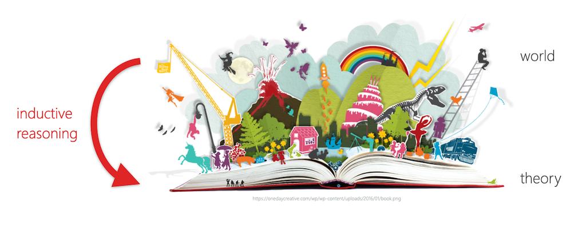
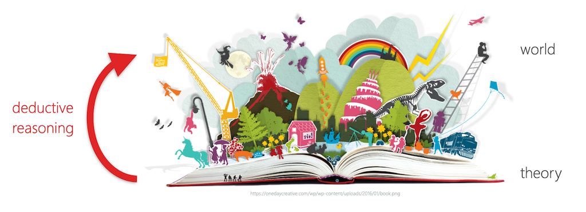
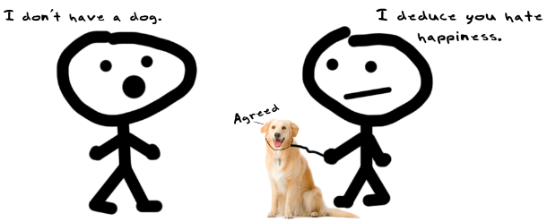
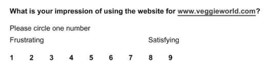
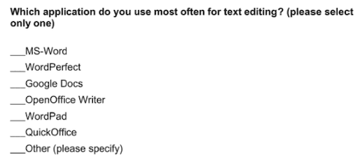
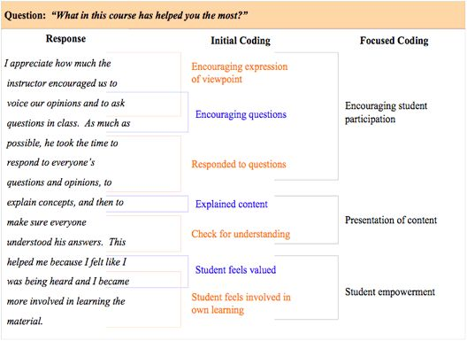
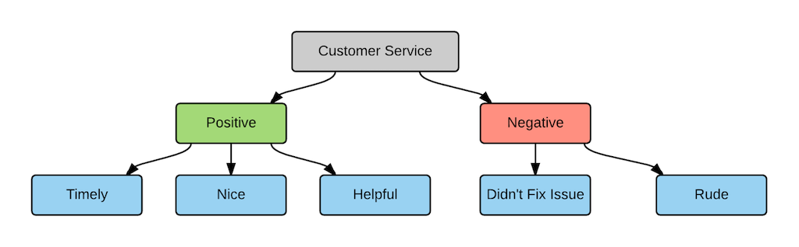
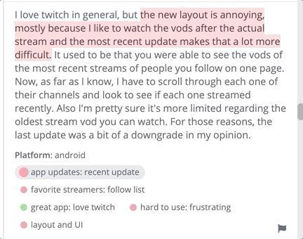

name: inverse
layout: true
class: center, middle, inverse
---

# Academic Methodologies

### Prof. Dr. Lena Gieseke | l.gieseke@filmuniversitaet.de  

#### Film University Babelsberg KONRAD WOLF

---
layout: false
  
## Today

--

* Your Methodology

--

* Recap Reasoning

--

* Quantitative and Qualitative Methodologies

--

* Qualitative Research

---
template: inverse

### Your Paper
  
## Methodology

???
* Any questions?

Develop your methodology

* Overall paper structure (sections)
* Bullet points for each section

On a side note: the doesn't need to be the final version, we will iterate on it.

It is time to think about how you want to answer the question(s) you are posing.  

Brainstorm which methods and/or which steps you want to apply. This task does not aim to find your personal journey of investigation. You should work on defining the approach that you will present in a paper as your methodology (but of course, you can also reflect on what you, personally, need to do to get there). 

*Submission*: Your paper structure and bullet points ofr each section

---
template: inverse

### Recap
  
## Reasoning

---
layout: false

.footnote[[Francisco Goya - ***The sleep of reason produces monsters***, 1799.]]    

???
  

Reasoning can be done well and it can be done badly and it can be done correctly or incorrectly. 

What is the difference between good and bad reasoning. What is the spectrum?

---
.header[Reasoning]

## Logic

Logic is the discipline that aims to distinguish good reasoning from bad. 
  
 
  
> Logic is the study of how ideas reasonably fit together. 

???
  

* When you apply logic, you must be concerned with analyzing ideas and arguments by using reason and rational thinking, not emotions or mysticism or belief.

All academic disciplines employ logic

* to evaluate evidence, 
* to analyze arguments, 
* to explain ideas, and 
* to connect evidence to arguments. 

There are a variety of different types of logical reasoning and methods for it. 
  
Hence, there are many approaches to the logical enterprise. 

* A logic must formulate precise standards for evaluating reasoning and develop methods for applying those standards to particular instances.
* We will have a brief look into different standards that follow the core principle of applying logic.

???
  

* What is inductive reasoning?

---
.header[Reasoning | Inductive Reasoning]

## Empiricism

--

> All our knowledge is based on our experiences in the world.

???
  

* One could intuitively say, that all our knowledge is based on our experiences in the world. 
* Hence, in order to come up with truth and knowledge, we need to have a closer look into our experiences in the world. That is what the *[Empiricism](https://en.wikipedia.org/wiki/Empiricism)* philosophy of science assumes.
* Empiricism considers knowledge to come only or primarily from (sensory) experience. 
* Historically, empiricism relates to the concept of [tabula rasa](https://en.wikipedia.org/wiki/Tabula_rasa) (*blank slate*), according to which the human mind is *blank* at birth and develops its thoughts only through experience. This theory denies that humans have innate ideas and this image dates back to Aristotle.

---
.header[Reasoning]

## Inductive Reasoning

.center[]

---
.header[Reasoning]

## Inductive Reasoning

> An inductive argument is an argument which conclusion is supposed to follow from its premises with a high level of probability. 

???
  
* Formulate general statements or laws based on a number of observations of recurring patterns.
* It derives novel theories from the world.
* Specifically...

  
* which means that although it is possible that the conclusion doesn’t follow from its premises, it is unlikely that this is the case. [[37]](https://viva.pressbooks.pub/letsgetwriting/chapter/what-is-logic/)
* There are also different subtypes of inductive reasoning but for us it is enough to grasp the general concept.

---
.header[Reasoning]

## Inductive Reasoning

A classic example of inductive reasoning comes from the empiricist [David Hume](https://en.wikipedia.org/wiki/David_Hume):

> Premise: *The sun has risen in the east every morning up until now.*  

--
> Conclusion: *The sun will also rise in the east tomorrow.*

---
.header[Reasoning]

## Inductive Reasoning

Hence, you can describe the process of inductive reasoning as

--
* a collection of related samples (premises),
* theory formation (induction), and
* transfer of theory to the whole population (conclusion).  

--
  
 
  
The truth of the conclusion of an inductive argument **can only ever be *probable*** - based upon the evidence given. 

???
  

* Hence, an inductive reasoning and its conclusion is either strong or weak, not right or wrong. 
* If an inductive argument is strong, the truth of the premise would mean the conclusion is likely. If an inductive argument is weak, the logic connecting the premise and conclusion is incorrect.
  

---
.header[Reasoning]

## Inductive Reasoning

> Even if all of the premises are true in a statement, inductive reasoning allows for the conclusion to be false. 
  

 

Inductive reasoning must be based on *repetitive behavior* and *patterns*. 

???
  

What is the problem with the following reasoning?

Premise: *I saw a black dog.*  
Conclusion: *All dogs are therefore black.*  

Premise: *Harold is a grandfather. Harold is bald.*  
Conclusion: *All grandfathers are bald.*  
  
The above conclusions do not follow logically from the statements as they are referring to *too few samples* and observations from which you could generate a pattern.   

--

Inductive arguments might be correct but differ in quality.

???
  

* Premise 1: Susie has walked by Mack the dog every day for ten days.
* Premise 2: Mack the dog has never bitten Susie.
* Conclusion: Thus, when Susie walks by Mack the dog today, he will not bite her.
  

* Premise 1: Susie has walked by Mack the dog every day for five years.
* Premise 2: Mack the dog has never bitten Susie.
* Conclusion: Thus, when Susie walks by Mack the dog today, he will not bite her.

* This argument, with more data to consider (five years of information instead of just ten days), is much stronger. An argument also gets stronger when reasons are added:

* Premise 1: Susie has walked by Mack the dog every day for five years.
* Premise 2: Mack the dog has never bitten Susie.
* Premise 3: Mack’s owners trained him to be friendly to people.
* Premise 4: Mack the dog’s breed is not known for aggression.
* Conclusion: Thus, when Susie walks by Mack the dog today, he will not bite her.

* This argument is even stronger. Not only does it have more data, but it also has additional reasons for Mack’s gentle nature.
* Inductive reasoning is an integral part of *Empiricism*, but can - as a type of reasoning - be applied in any context.
* Question: *What could be arguments against the validity of Empiricism?*
* Philosophers such as [David Hume](https://en.wikipedia.org/wiki/David_Hume) argued that truly undirected observations are hardly possible. Human experiences and observations are not necessarily equal to facts in nature but are based on the manner of perception. We can only *interpret* our sensory experiences. Also, humans tend to see *causalities* what in truth are only *correlations* (we will come back to this).

  

---
.header[Reasoning]

## Absolut Truths

*From what kind of observations of the world can we derive absolut truths?*  

???
  

* Addressing these counter arguments to (also called *naïve*) Empiricism, *[Critical Rationalism](https://en.wikipedia.org/wiki/Critical_rationalism)* (or *Neo-positivism*) states that there is no absolute truth, only *hypotheses*.
* One of the 20th century's most influential philosophers of science, [Karl Popper](https://en.wikipedia.org/wiki/Karl_Popper) rejected the empiric principle of induction and stated that you can not derive a general theory from a collection of individual samples, which in number are always limited and which is therefore logically inadmissible. Popper concludes that a theory in the empirical sciences can never be fully proven, but it can be only be *falsified*.  
* As an example imagine that you have developed a software and you want to prove that it is bug-free. You conduct a variety of successful tests. But can you really be sure that the software is bug free? Probably not. The validating tests *indicate* the correctness of your software but they can not prove it. However, as soon as you find another error, it is *proven* that your software is not bug-free!

--
  

> Only observations that *falsify* a statement are of absolute truth!

???
  

* In common language, a statement is falsifiable if some observation might contradict it.

--

Knowledge is then the collection of non-(yet)-falsified hypotheses. 

???
  

> Falsification strives for the falsification of hypotheses instead of proving them. 

A hypothesis is a falsifiable assumption, which is valid as long as it is not falsified. 
  
Unsuccessful falsification *indicates* a correct assumption.

* Especially in natural sciences knowledge is tentative and probabilistic, subject to continued revision and falsification.
* Popper states that while there is no way to prove that the sun will rise, it is possible to formulate the theory that every day the sun will rise; if it does not rise on some particular day, the theory will be falsified and will have to be replaced by a different one. Until that day, there is no need to reject the assumption that the theory is true.

*What is the falsifiability of the following hypotheses?*  
*Why might they not be falsifiable?*

* Cows sleep while standing, as they would die otherwise.
    * Falsifiable - and as there have been cows sleeping while lying and they didn’t die, hence this hypothesis is already falsified.
* Smarties fly worse than M&Ms. 
    * Not falsifiable, as “fly worse” is not well defined.
* The number of transistors on a chip will continue to double approximately every two years in the future.
    * Currently not falsifiable, only in retrospect.

* A weakness of Falsificationism is that some theories cannot be ultimately falsified (e.g. gravity). Here, Popper divides falsifiability into logical and practical falsifiability. Logical falsifiability means that there exists an experiment, which can falsify the theory. Practical falsifiability means that the experiment is realizable in practice, too (e.g. impossible for some experiments in astronomy or astrophysics). [[29]](http://wwwmayr.informatik.tu-muenchen.de/personen/baumgart/download/public/presentation_CR.pdf)

---
.header[Reasoning]

## Rationalism

???
  

* A similar line of thought and a movement that Critical Rationalism and Falsificationism is based on is Rationalism. 
* Rationalism "regards reason as the chief source and test of knowledge" [[4]](https://www.britannica.com/topic/rationalism) and is defined as a methodology "in which the criterion of the truth is not sensory but intellectual and deductive". [5] [[3]](https://en.wikipedia.org/wiki/Rationalism)
* This leads us to the second type of reasoning, *deductive reasoning*. 
* Do you know what that is?

--

> The criterion of the truth is not sensory but intellectual and deductive.

--
  
 

Deductive reasoning goes from a theory to its verification through observations of the world.  

--
  
It tests the validity of existing assumptions in reality.

---
.header[Reasoning]

## Deductive Reasoning

.center[]

---
.header[Reasoning]

## Deductive Reasoning

> A deductive argument is an argument whose conclusion is supposed to follow from its premises with absolute certainty, thus leaving no possibility that the conclusion doesn’t follow from the premises.  

???
  

* also deductive logic
* Deductive reasoning is the process of reasoning from one or more statements (premises) to reach logically certain conclusion. 
  
If a deductive argument fails to guarantee the truth of the conclusion, then the deductive argument can no longer be called a deductive argument.
  
* In common language, deductive reasoning ("top-down logic") goes from the generalization (a theory) to the specific (observations in the world) in contrasts to inductive reasoning ("bottom-up logic"), which goes from the specific (observations in the world) to the generalization (a theory).  

---
.header[Reasoning]

## Deductive Reasoning

If something is true of a class of things in general, it is also true for all members of that class:

--
* Premise 1: *All men are mortal.*  
* Premise 2: *Socrates is a man.*  
* Conclusion: *Therefore, Socrates is mortal.*  

???
  

* Premise: *All ravens are black.*  
* Conclusion: *Therefore, when one encounters George the raven, George will be black.*  

---
.header[Reasoning]

## Deductive Reasoning

If the generalization is wrong, meaning the premise, the conclusion may be logical, but it may also be untrue.  

--
* Premise 1: *All bald men are grandfathers.*  
* Premise 2: *Harold is a bald.*  
* Conclusion: *Therefore, Harold is a grandfather.*  

???
  
The argument is logically valid but it is untrue because the premise is false.  
  
* In deductive reasoning a conclusion is either true or false and cannot be partly true or partly false. 

We decide whether a deductive statement is true by assessing 

1. the correctness of the premises, and
2. the validity of the link between the premises and the conclusion.  

Validity relates to how well the premises support the conclusion.  
  

* A *valid* argument is an argument whose conclusion cannot possibly be false, assuming that the premises are true. 
* "If all men are mortal and Socrates is a man," there is no way Socrates can not be mortal, for example. There are no situations in which the premise is not true, so the conclusion is true. 
* However, "George was President of the United States. Therefore, George was elected President of the United States." is an *invalid* argument because it is possible for the premise to be true and yet the conclusion false. 
* A *counterexample* to the argument is that Gerald Ford was President of the United States, but he was never elected president because Ford replaced Richard Nixon when Nixon resigned in the wake of the Watergate scandal. Therefore, it does not follow that just because someone is President of the United States that he was elected President of the United States. This means that the argument is invalid. 

--
If an argument is invalid, it will always be possible to construct a *counterexample* to show that it is invalid. 
  

???
  

*A deductive argument which is not only *valid* but for which also all premises are correct is considered a *sound* argument. That means that the conclusion, or claim, of a sound argument will always be true because if an argument is valid, the premises transmit truth to the conclusion on the assumption of the truth of the premises. 

A counterexample is simply a description of a scenario in which the premises of the argument are all true while the conclusion of the argument is false.
  
*Bob is a fireman. Therefore, Bob has put out fires.*

*Bob is taller than Susan. Susan is taller than Frankie. Therefore, Bob is taller than Frankie.*

---
.header[Reasoning]

## Inductive vs. Deductive Reasoning

|                | Deduction                                                     | Induction                                                                             |
| -------------- | ------------------------------------------------------------- | ------------------------------------------------------------------------------------- |
| Logic          | When the premises are true, the conclusion must also be true. | Known premises are used to generate probable conclusions.                             |
| Generalization | Generalizing from the general to the specific.                | Generalizing from the specific to the general.                                        |
| Use of Data    | Evaluate hypotheses related to an existing theory.            | Explore a phenomenon, identify themes and patterns and create a conceptual framework. |
| Theory         | Theory falsification or verification.                         | Theory generation and building.                                                       |

???

scientific method
  
* The scientific method requires that a scientist test a theory based on observed or predicted facts. 
* The scientist must formulate a theory or a hypothesis based on what has been observed, and then 
* design a test by which the theory may be verified as valid or not. 

1. Make an observation.
2. Ask a question.
3. Form a (falsifiable) hypothesis, or testable explanation.
4. Make a prediction based on the hypothesis.
5. Test the prediction.
6. Interpret data and draw conclusions
7. Iterate: use the results to make new hypotheses or predictions.

* Reproducibility
* Comparability
* Predictability
    * Of future events
    * The precision of these predictions is a measure of the strength of the theory
* Falsifiability  

  
In modern applications of the scientific method, only falsifiable hypotheses are accepted.

*Does the scientific method apply inductive or deductive reasoning?*

One can argue that the scientific method actually brings inductive and deductive reasoning together. 

* Steps 1-3 and the formulation of a hypothesis require inductive reasoning, while step 4-6 follow deductive reasoning.
* In science there is a constant interplay between inductive inference (based on observations) and deductive inference (based on theory), until we get closer and closer to the 'truth,' which we can only approach but not ascertain with complete certainty.  —Dr. Sylvia Wassertheil-Smoller

---
.header[Reasoning]

## Fallacies

.center[.imgref[[[punchdebtintheface]](https://www.punchdebtintheface.com/great-deduction-debate/)]]

--
  
 

Fallacies are errors or tricks of reasoning.  

???
  

* A fallacy is an error of reasoning if it occurs accidentally; it is a trick of reasoning if a speaker or writer uses it to deceive or manipulate his audience. 
* See the script for more on this topic.

---
.header[Reasoning]

## Hermeneutics

--
One inherently different approach to gaining truthful knowledge.

* The methodology of *interpretation*
* Emphasizes *subjectivity* as crucial part of reality.

--
  
 
  
Hermeneutics forms an opposite to research strategies, which stress objectivity and independence from interpretations in the formation of knowledge.  

???
  
* e.g. in interpretations in the research of finding the meaning of texts, art, culture, social phenomena and thinking. There is an ongoing philosophical study of *subjectivity* but hermeneutic understands subjectivity as crucial part of reality. 
* Question: *On which fundamental aspect of western culture might this approach be based on?*

Well, for a long time all aspects of society were strongly influenced - if not controlled - by *one book*, namely the bible and scripture. But western hermeneutics starts as early as in the writings of Aristotle. There has been a highly developed practice of interpretation in Greek antiquity, aiming at oracles, dreams, myths, philosophical and poetical works, but also laws and contracts. The modern discipline of hermeneutics emerged as a response to the questions raised by the reformation debate about the *authentic meaning* of the biblical text. The reformers challenged the Roman catholic understanding that the text could only be interpreted through the lens of tradition and that its true meaning was not immediately evident to the individual reader. Reformers asserted that truth was accessible to the contemporary reader and that the basis for faith and doctrine could be developed without reference to tradition but purely based on the text itself.  

Due to its long history, it is only natural the discipline of hermeneutics has shifted considerably over time.  
  
This methodology can provide us guidance for solving problems of interpretation of human actions, texts and other meaningful material.

---
.header[Reasoning]

## Summary Reasoning

> The logical foundation of how knowledge is generated and evaluated. 
  
--

* Distinguishing scientific claims from unfounded assertions
* Help you to critically test and refine your work
* Reasoning types are usually not specifically mentioned in the description of a methodology

---
template:inverse

# Quantitative and Qualitative Methodologies

???
  

The methodologies of *quantitative* and *qualitative* research can guide you through your selection of methods for your *data collection* and *analysis*.

---
## Quantitative Research

???
  

* Means what?
--

Systematic empirical investigation of observable phenomena via *statistical*, *mathematical*, or *computational techniques*.  

--

 
**The process of measurement is central.**

???
  

* Connection between empirical observation and mathematical expression of quantitative relationships
* In humanities / social sciences often understood as an *standardised approach*
    * Unification and generalisation of certain methods, e.g. conducting interviews
--

 
> There is an objective reality, which can be described and which we approach step by step or measure.

???
  

* Quantitative research is widely used in psychology, economics, demography, sociology, marketing, community health, health & human development, gender studies, and political science; and less frequently in anthropology and history. 
* Research in mathematical sciences, such as physics, is also "quantitative" by definition, though this use of the term differs in context. In the social sciences, the term relates to empirical methods originating in both philosophical positivism and the history of statistics, in contrast with qualitative research methods.
* Quantitative research is generally closely affiliated with ideas from 'the scientific method'. [[22]](https://en.wikipedia.org/wiki/Quantitative_research)
* I noticed that in social sciences the term *quantitative* might be used slightly differently. Within a context with strong focus on qualitative methods, a quantitative approach is sometimes understood as a *standardized* approach, which unifies and generalizes the use of certain methods, e.g. when conducting interviews. In this context it does not necessarily mean that you work with numerical data.

Within the context of Creative Technologies:

* Come up with a research question, which should be answered with a quantitative approach.

* Which color button are users most likely to click on a landing page of our website?
* Do people get excited to see art work X?

---
## Qualitative Research

???
  

* Means what?
--

Systematic observation to gather *non-numerical data*, focusing on meaning-making.  

???
  

* Refers to the meanings, concepts definitions, characteristics, metaphors, symbols, and description of things" and not to their "counts or measures".

--

 

**The *why* and *how* are central** as opposite to *how often*.

???
  

* Qualitative research approaches are employed across many academic disciplines, focusing particularly on the human elements of the social and natural sciences. [23] 

There are various qualitative research methods. A common feature of these methods is an emphasis on points of view of, expressions, and *language*. Qualitative methods include for example interviews, focus groups, ethnographic research (studying people in their naturally occurring environment), case studies, record keeping, the process of observation, participant observation, etc.

--
  
 

> Reality is a social construct and we can find its interpretations but not a factual structure of reality.

---

## Quantitative vs. Qualitativ

???
* Quantitative data is any data that is in *numerical* form such as statistics, percentages, etc. [23] The researcher analyses the data with the help of statistics and hopes the numbers will yield an unbiased result that can be generalized to some larger population. 
* Qualitative research, on the other hand, inquires in-depth specific experiences, with the intention of describing and exploring meaning through text, narrative, visually, or by developing themes exclusive to that set of participants. [24]

--

| Step      | Quantitative Methodology | Qualitative Methodology       |
| --------- | ------------------------ | ----------------------------- |
| Reasoning | Deduction                | Induction                     |
|           | Objectivity              | Subjectivity                  |
|           | Causation                | Meaning                       |
| Question  | Pre-specified            | Open-ended                    |
|           | Outcome-oriented         | Process-oriented, explorative |
| Analysis  | Numerical                | Narrative                     |
|           | Statistical inference    | Comparative                   |

 

This categorization is by no means absolute!  

???

You can use both strategies to complement each other in one research project.
* However, the above is by no means absolute! Quantitative research and qualitative research form a methodological pair. You can use both strategies to complement each other in one research project or to act as separate analyses of a single research topic. For example, qualitative research produces information only on the particular cases studied, and any more general conclusions are only hypotheses. Quantitative methods can be used to verify which of such hypotheses are true.  
* While a quantitative or qualitative methodology mainly implies the usage of certain methods, there are also some methods which are somewhat of a mid-way point.  
* Whether or not you decide to use and / or combine qualitative and quantitative methods in your research depends on your research question and your philosophical position (this maybe less important for now).

Within the context of Creative Technologies:

* Come up with a research question, which should be answered with a qualitative approach.

* What does people excite about art work X?
* What kinds of barriers do people with disabilities face when trying to access VR experiences?

---

## Mixed Methods Methodology

* Combines quantitative and qualitative methods
* Explanatory and exploratory

???
  
A study on the effectiveness of a new teaching method might:
  
* Collect test scores (quantitative) to measure learning outcomes.
* Conduct interviews (qualitative) to understand student experiences and perceptions.

--

> Can be pretty much anything...

???
Media studies often uses qualitative research, but it is not limited to it. Media studies is an interdisciplinary field that can draw on qualitative, quantitative, or mixed methods, depending on the research question.

Common qualitative approaches in media studies:
* Textual analysis (e.g., analyzing film, TV, or social media content)
* Discourse analysis (e.g., examining language in news reporting)
* Audience studies (e.g., interviews or focus groups on media reception)
* Ethnography (e.g., studying online communities or production cultures)
* Historical or archival research (e.g., investigating media institutions or technologies over time)

Quantitative methods are also used in media studies:
* Surveys (e.g., measuring media consumption habits)
* Content analysis with coding (e.g., tracking how often a theme appears across many articles)
* Statistical modeling (e.g., studying the spread of information or media effects)

Summary:

Media studies often leans qualitative, especially in cultural, critical, or interpretive work. But it also includes quantitative approaches, especially in communication science or media psychology. Many scholars use mixed methods to combine both.

---
template:inverse

# Qualitative Research

---
layout: false

## Research Methods

The most common methods for qualitative research are

--

* Case Studies
* Surveys
* Diaries
* Interviews
* Ethnographie
  
--
  
These methods are usually analyzed by *coding*.

---
## Research Methods

The most common methods for qualitative research are
  
* **Case Studies**
* **Surveys**
* Diaries
* **Interviews**
* Ethnographie
  
  
These methods are usually analyzed by *coding*.

???
  

* A **diary** is a document created by an individual who maintains regular recordings about events in their life, at the time that those events occur.
    * These recordings can be anything from a simple record of activities (such as a schedule) to an explanation of those activities to personal reflections on the meaning of those activities. When you are asking people to record information that is fluid and changes over time, such as their mood, or about multiple events that occur within the day, diaries are generally more accurate than other research methods (Alaszewski, 2006).
    * Open in what is recorded, it can be anything from the participants activities, to mood, etc. 
        * For observations that can not easily be measured, such as happiness
    * Appropriate when there little knowledge about a scenario
    * Used to find patterns, motivations, behavior and habits
    * Example - Time Diaries to Study User Frustration
* **Ethnography** is the type of qualitative research that involves immersing yourself in a particular community or organization to observe their behavior and interactions up close. 
    * understanding the context of technology usage. By examining the human, social, and organizational contexts of technology, a deeper understanding of who these users are can be developed. In ethnographic traditions, a better understanding of a group of people and their traditions and processes is itself a noble and worthwhile goal. However, in the HCI community, ethnography is often used as a first step, to understand a group of users, their problems, challenges, norms, and processes, with the eventual goal of building some type of technology for them or with them.
    * The researcher becomes part of the study

---
.header[Qualitative Research Methods]

## Case Studies

--

> A case study is an in-depth study of a specific instance or few instances, usually conducted within a specific real-life context.  

--

* Context-dependent
* Deep and narrow
* Small set of samples
* Does not aim for generalization

--

Traditionally, a qualitative method, in reality often a mixed method.

???
  

* They are deep and narrow, focusing on thorough exploration of a small set of samples. They do not aim for generalization.

* For experiments, surveys, etc. it is usually the more the merrier in regard to the number of samples. However, for certain research projects and for certain scenarios a large sample is extremely difficult if not impossible. Fortunately, this is not a cause for despair. Case studies, in which researchers study a small number of participants (possibly as few as one) in depth, can be useful tools for information gathering and evaluation.  

---
.header[Qualitative Research Methods]

## Case Studies

1. Feasibility study: *Is it possible?*
    * Proof by construction; one first case

.footnote[Serge Demeyer. *Research Methods in Computer Science*. University of Antwerp.]

---
.header[Qualitative Research Methods]

## Case Studies

1. Feasibility study: *Is it possible?*
2. Pilot Case / Demonstrator: *Is it appropriate?*
    * Demonstrated on a simple yet representative case

.footnote[Serge Demeyer. *Research Methods in Computer Science*. University of Antwerp.]

---
.header[Qualitative Research Methods]

## Case Studies

1. Feasibility study: *Is it possible?*
2. Pilot Case / Demonstrator: *Is it appropriate?*
3. Comparative Study: *Is it better?*
    * Score criteria check-list; often by applying on one or few cases

.footnote[Serge Demeyer. *Research Methods in Computer Science*. University of Antwerp.]

---
.header[Qualitative Research Methods]

## Case Studies

1. Feasibility study: *Is it possible?*
2. Pilot Case / Demonstrator: *Is it appropriate?*
3. Comparative Study: *Is it better?*
4. Observational Study: *What is it?*
    * Observing a series of cases

.footnote[Serge Demeyer. *Research Methods in Computer Science*. University of Antwerp.]

---
.header[Qualitative Research Methods]

## Case Studies

1. Feasibility study: *Is it possible?*
2. Pilot Case / Demonstrator: *Is it appropriate?*
3. Comparative Study: *Is it better?*
4. Observational Study: *What is it?*
5. Literature Survey: *What is known?*
    * Cases = selected papers

.footnote[Serge Demeyer. *Research Methods in Computer Science*. University of Antwerp.]

---
.header[Qualitative Research Methods]

## Case Studies

1. Feasibility study: *Is it possible?*
2. Pilot Case / Demonstrator: *Is it appropriate?*
3. Comparative Study: *Is it better?*
4. Observational Study: *What is it?*
5. Literature Survey: *What is known?*
6. Formal Model: *Underlying concepts?*
    * Often explained using a case

.footnote[Serge Demeyer. *Research Methods in Computer Science*. University of Antwerp.]

---
.header[Qualitative Research Methods]

## Case Studies

1. Feasibility study: *Is it possible?*
2. Pilot Case / Demonstrator: *Is it appropriate?*
3. Comparative Study: *Is it better?*
4. Observational Study: *What is it?*
5. Literature Survey: *What is known?*
6. Formal Model: *Underlying concepts?*
7. Simulation: *What if?*
    * Test prognoses with real observations obtained via one or few cases

.footnote[Serge Demeyer. *Research Methods in Computer Science*. University of Antwerp.]

---
.header[Qualitative Research Methods]

## Case Studies

1. Feasibility study: *Is it possible?*
2. Pilot Case / Demonstrator: *Is it appropriate?*
3. Comparative Study: *Is it better?*
4. Observational Study: *What is it?*
5. Literature Survey: *What is known?*
6. Formal Model: *Underlying concepts?*
7. Simulation: *What if?*

.footnote[Serge Demeyer. *Research Methods in Computer Science*. University of Antwerp.]

???

1. Feasibility study: *Is it possible?*
    * Proof by construction; one first case
2. Pilot Case / Demonstrator: *Is it appropriate?*
    * Demonstrated on a simple yet representative case
3. Comparative Study: *Is it better?*
    * Score criteria check-list; often by applying on one or few cases
4. Observational Study: *What is it?*
    * Observing a series of cases
5. Literature Survey: *What is known?*
    * Cases = selected papers
6. Formal Model: *Underlying concepts?*
    * Often explained using a case
7. Simulation: *What if?*
    * Test prognoses with real observations obtained via one or few cases

---
.header[Qualitative Research Methods | Case Studies]

## Choosing Cases

A case can be pretty much anything:

* As representative as possible
* Multiple cases, similar scenarios
* Edgy cases, outlier
* Critical cases

???

There are really no rules on what a case can be. You can chose a case as representative as possible, multiple-cases, edgy cases, critical cases and so on.  

--

How you chose your case must be thoroughly described. You could also use a specific method, e.g. a *screening survey* to find your case. 

???
  

* A carefully constructed survey of potential participants can provide data that informs your selection process. Such surveys might assess both the fit between the participants and your criteria and the willingness of the participants to commit their time and energy to the success of the study.

---
.header[Qualitative Research Methods | Case Studies]

## Examples

* How do populist politicians use narratives about history to gain support? → Case studies of narratives used by Hungarian prime minister Viktor Orbán and US president Donald Trump.

--
* How can teachers implement active learning strategies in mixed-level classroom? → Case study of a local school that promotes active learning.

--
* What are the main advantages and disadvantages of wind farms for rural communities? → Case studies of three rural wind farm development projects in different parts of the country. 

---
.header[Qualitative Research Methods | Case Studies]

## Examples

* How are marketing strategies changing the relationship between companies and consumers? →  Case study of the iPhone X marketing campaign.

--
* How do experiences of work in the gig economy (temporary, flexible jobs) differ by gender, race and age? → Case studies of a number of Lieferando and Uber drivers in Berlin.

---
.header[Qualitative Research Methods | Case Studies]

## Example: Research through Design

???
* What is the case?

--

The case is a design artifact 

--
vs. real-world phenomena as with "traditional" case studies.

--

 
The design practice itself is used as a method of inquiry.  

> The design process is central to the research, not just the outcome.

--
  
* Focuses deeply on a specific context or artifact
* Situated, context-rich
* Generalizable through reflection on particular examples

???

Researchers generate knowledge by creating, reflecting on, and analyzing designed artifacts (such as prototypes, systems, or experiences).

Key points:
	•	The design process is central to the research, not just the outcome.
	•	It produces situated, practice-based knowledge.
	•	Reflection on the design process and decisions helps generate insights.
	•	Common in interaction design, artistic research, and creative technologies.

In short: RtD uses designing as a way to investigate and understand complex issues—not just to solve them.

---
template:inverse

## Surveys

---
.header[Qualitative Research Methods]

## Surveys

--

> A survey is a method of gathering information by asking questions to a subset of people, the results of which can be generalized to the wider target population. 

--

* One of the most commonly used research methods, across all fields of research
* Easy to setup, easy to mess up

???
  

* One of the reasons why surveys may be maligned is that they are often used not because they are the most appropriate method but because they are the easiest method. There are a lot of bad research projects, in which professors or students quickly write a survey, do not do sufficient pilot testing of the survey questions, distribute it to first-year students, and then claim that the survey results can generalize to other populations. Unless the actual focus of the research is university students, then this common research scenario is misguided.

---
.header[Qualitative Research Methods]

## Surveys

Survey research may be the most appropriate methodology for measuring parameters such as

--

* *Attitudes*, *Intent*, *Awareness*, etc.
* *User experiences*
* *Characteristics of users*
* *Over-time comparisons*

--

Survey work with a large sample size. The gathered data usually aims to generalize.

---
.header[Qualitative Research Methods]

## Surveys
  
--
Can be set up as qualitative as well as quantitative, depending on the questions.

--

 

**Surveys are less appropriate for precise measurements. **

---
.header[Qualitative Research Methods]

## Surveys

Surveys usually rely on users to complete the survey on their own. Hence the survey must be carefully designed.

--
* Target users and inclusion and/or exclusion criteria
* Enough background information
* Self-explanatory, explicit and non-biased questions
* A balance between length and data collection

--

A common value for a response rate is 20% (only!).

---
.header[Qualitative Research Methods | Surveys]

## Developing Questions

A survey has two structures

* the *overall structure* of a survey, 
* and the *structure of a single question*.

???
  
  
The main challenge is to develop precise but easy to understand and non-biased questions. 

Think of the overall structure as the *storyline* of the survey.

* Instructions
* Motivation
* Flow of topics
* Grouping of questions
* Demographic questions

You also should think about the visual layout.

Single questions can be categorized in three types: as 

* open-ended questions, 
* closed-ended questions with ordered response categories, or 
* closed-ended questions with unordered response categories 
 

* The questions do not exist in a vacuum, rather, they are part of an overall survey structure. Try to create a story-line for the survey so that respondents get a sense of order. Usually a survey, in any format, must begin with instructions. These instructions must make clear how the respondent is to interact with the survey (Babbie, 1990, as cited in [1]). It also helps if you can motivate people to the survey and complete it. Generally, it is a good idea to leave demographic questions until the end of the survey, as these are the least interesting (Babbie, 1990, as cited in [1]). Questions relating to a similar topic or idea should be grouped together (Dillman, 2000, as cited in [1]). You should use sections and a well-balanced layout. This tends to lower the cognitive load on respondents and allows them to think more deeply about the topic, rather than switching gear after every question.

---
.header[Qualitative Research Methods | Surveys]

## Open-Ended Questions

???
  

* Give respondents complete flexibility in their answers
* Complex data analysis
* Must be carefully worded for respondents to stay on topic

--

* *Why did you stop using software X?*

???
  

* This open-ended question provides no information about the possible causes; instead it requires the respondent to think deeply about what the causes might be (Dillman, 2000, as cited in [1]). The respondent may be too busy to come up with a complete response or may simply say something like "I didn't like the software". It is a very broad question. More specific questions might be:  

--
* *Did software X allow you to complete the tasks that you wanted to complete?*

--
* *How did you feel about the usability of software X?* 

???
  

* These questions address more specific topics: ease of use and task completion. The respondents cannot simply answer "I didn't like it,” although they could just answer “yes” or “no” to the second question. Perhaps another way to reword that second question might be as:  

--
* *What barriers did you face in attempting to use software X to complete your tasks?*

???
  

* In that revision, the respondents could simply say, “none” but the question also invites the respondents to think carefully about the problems that they might have faced.

---
.header[Qualitative Research Methods | Surveys]

## Closed-Ended Questions

???
  

A number of choices is given.

--

* E.g. [Likert scale questions](https://en.wikipedia.org/wiki/Likert_scale)

.center[]

???
  
, which often take the form of a scale of 1 to 5, 7, or 9, ask users to note where they fall on a scale of, for example, *strongly agree* to *strongly disagree*.
* [[quis]](http://www.lap.umd.edu/quis/) *A closed-ended question with an ordered response.*

--

* Choices that do not have a logical order.

.center[]

???
  

* For instance, asking about types of software applications, hardware items, user tasks, or even simple demographic information such as gender. Closed-ended questions can allow for a single or multiple selections.
* [[1]]() *A closed-ended question with an unordered response.*

---
.header[Qualitative Research Methods | Surveys]

## Questions - Common Problems

--
* Missing precision leads to confusion and random answers 

???
  

* (e.g., "Which meaning has astronomy in your life?")

--
* A *double-barreled question* asks two separate, and possibly related questions 

???
  
* (e.g., “How long have you used the Word processing software and which advanced features have you used?”). These questions need to be separated.

--
* Complex phrasings, e.g., with negations, cause confusion

???
  

* (e.g., “Do you agree that the e-mail software is not easy to use?”) can cause confusion for the respondents.

--
* Biased wordings 

???
  

* in questions (such as starting a sentence with “Don't you agree that…”) can lead to biased responses. If a question begins by identifying the position of a well-respected person or organization (e.g., “Angela Merkel [or Rezo] takes the view that…”), this may also lead to a biased response.

--
* *Hot-button words* leading to biases

???
  
such as “left-winged,” “conservative,” “terrorism,” etc. can lead to biased responses.
* Researchers should carefully examine their questions to determine if any of these problems are present in their survey questions (Babbie, 1990):

---
.header[Qualitative Research Methods | Surveys]

## Existing Surveys

There are many existing surveys

* Validated in the [research literature](https://garyperlman.com/quest/) in HCI
* In a commercial context ([Survey Monkey](https://www.surveymonkey.com/mp/survey-templates/), [Qualtrics](https://www.qualtrics.com/marketplace/survey-template/), etc.)

???
  

*  For most research purposes, there will be a need to create a new survey. However, for tasks such as usability testing and evaluation, there are already a number of existing survey tools. Usually, these surveys can be modified in minimal ways.

---
.header[Qualitative Research Methods | Surveys]

## Pilot Testing

* Crucially important
* Often neglected

???
  

After a survey tool is developed, it is very important to do a pilot study to help ensure that the questions are clear and unambiguous.  

A pilot study should focus on

* the questions, and
* interface of the survey.

---
template:inverse

## Interviews & Focus Groups

---
.header[Qualitative Research Methods]

## Interviews & Focus Groups

--

> Interviews are targeted discussions with carefully selected respondents.
  
  
???
  
* What are the ecological effects of wolf reintroduction? → Case study of wolf reintroduction in Yellowstone National Park.
* Potential users, domain experts and stakeholders as respondents for example can help human-computer interaction researchers understand needs, challenges, reactions to new tools, and uses of tools in practice. Conducting effective interviews requires careful consideration of *who* to involve as participants and *how* the sessions might be structured, with possibilities ranging from completely structured interviews to semi-structured and unstructured interviews.  

  
> Focus groups are the interview of multiple participants at once, in a group.

* The choice of one-to-one interviews or focus groups involves trade-offs in time, expediency, depth, and difficulty. Focus groups let you hear from many people at once but with less depth from any given individual. You should consider the trade-off between this loss of depth and the potentially fuller understanding that may arise from a conversation between participants having multiple perspectives. Unfortunately, there are no guarantees: this intriguing dynamic conversation might not materialize. As the moderator of a focus group, you have a very important role to play: this is where the difficulty comes in. Skillful moderation can keep conversation focused and inclusive, increasing your chances of getting good data.

--

* Useful for understanding individual perspectives
* Crucial: *who* to involve and *how* to structure the sessions
* Structured, semi-structured and unstructured

---
template: inverse

# Analyzing Qualitative Data

---
.header[Qualitative Research Methods]

## Analysis

Qualitative methods do not aim to eliminate *subjectivity*. They accept that subjectivity is inherent to process of interpreting certain data.   

--
  

> They strive to show that interpretations are developed methodically to be consistent with, and representative for the available data.

???
  

In terms of qualitative research, 

* *validity* means that we use well-established and well-documented procedures to increase the accuracy of findings. 
    * More strictly speaking, validity examines the degree to which an instrument measures what it is intended to measure (Wrench et al., 2013, as cited in [1])
* *reliability* refers to the consistency of results. 
    * If different researchers working on a common data set come to similar conclusions, those conclusions are said to be reliable.If different researchers working on a common data set come to similar conclusions, those conclusions are said to be reliable.

---
.header[Qualitative Research Methods | Analysis]

## Coding

--

The goal is to give the unstructured data, e.g. found in texts, a structure.  

--
  
> Coding is the process of labeling and organizing your qualitative data to identify different themes and the relationships between them.  

???
  

* A *reliable* and *valid* method is *coding*, which assigns labels to observations.

* Imagine, you collected feedback about a developed website with open-ended, free-text questions (from reviews, surveys, complaints, chat messages, interviews, case notes, social media posts, etc.) and you end up with hundreds of free-text responses. How can you turn all of that text into applicable information to improve your system? By coding qualitative data.
* When coding e.g. open-ended text answers, you assign labels to words or phrases that represent important (and recurring) themes in each response. 

--

Once you have established such a coding, you can analyze your data. This can also be understood as a *thematic analysis*.

???
  

   Thematic analysis extracts themes from text by analyzing the word and sentence structure.

.center[[[pinimg]](https://i.pinimg.com/564x/4a/dc/45/4adc4569928cdb623f4ba21f788b7102.jpg)]

---
.header[Qualitative Research Methods | Analysis | Coding]

## Codes

> A code is a label.

--

Labels are ideally words or phrases.  

???
  

* .todo[TODO:] https://web.atlasti.com

--
* Deductive coding: predefined set of codes

???
  

* **Deductive** coding means you start with a *predefined set of codes*, then assign those codes to the new qualitative data.  

These codes might come from previous research, or you might already know what themes you’re interested in analyzing.  

Deductive coding is also called concept-driven coding.  

* For example, let’s say you’re conducting a survey on user experience with a web-store. You want to understand the problems that arise from long processing wait times, so you choose to make “processing wait time” one of your codes before you start looking at the data.  

The deductive approach can save time and help guarantee that your areas of interest are coded. But you also need to be careful of bias; when you start with predefined codes, you have a bias as to what the answers will be. Make sure you don’t miss other important themes by focusing too hard on proving your own hypothesis.  

--
* Inductive coding: create codes based on the data 

???
  

**Inductive** coding, also called *open coding*, creates codes based on the qualitative data itself.  
  

* You don’t have a set codebook; all codes arise directly from the survey responses.

* Here’s how inductive coding works:

1. Break your qualitative dataset into smaller samples.
2. Read a sample of the data.
3. Create codes that will cover the sample.
4. Reread the sample and apply the codes.
5. Read a new sample of data, applying the codes you created for the first sample.
6. Note where codes don’t match or where you need additional codes.
7. Create new codes based on the second sample.
8. Go back and recode all responses again.
9. Repeat from step 5 until you’ve coded all of your data.

If you add a new code, split an existing code into two, or change the description of a code, make sure to review how this change will affect the coding of all responses. Otherwise, the same responses at different points in the survey could end up with different codes.

Sounds like a lot of work, right?

Inductive coding is an iterative process, which means it takes longer and is more thorough than deductive coding. But it also gives you a more complete, unbiased look at the themes throughout your data.  

## Coding Frames

When you create your codes, you need to put them into a *coding frame*. 

> A coding frame represents the organizational structure of the themes in your research. 

There are two types of coding frames: flat and hierarchical.

* A flat coding frame assigns the same level of specificity and importance to each code. While this might feel like an easier and faster method for manual coding, it can be difficult to organize and navigate the themes and concepts as you create more and more codes. It also makes it hard to figure out which themes are most important, which can slow down decision making. 
* Hierarchical frames help you organize codes based on how they relate to one another. For example, you can organize the codes based on your customers’ feelings on a certain topic:

### Hierarchical Coding Frame

.center[[[thematic]](https://getthematic.com/insights/coding-qualitative-data/)]

Hierarchical framing supports a larger code frame and lets you organize codes based on an organizational structure. It also allows for different levels of granularity in your coding.  

In this example:

1. The top-level code describes the topic (customer service).
2. The mid-level code specifies whether the sentiment is positive or negative.
3. The third level details the attribute or specific theme associated with the topic.

* Whether your code frames are hierarchical or flat, your code frames should be flexible. Manually analyzing survey data takes a lot of time and effort; make sure you can use your results in different contexts.

For example, if your survey asks customers about customer service, you might only use codes that capture answers about customer service. Then you realize that the same survey responses have a lot of comments about your company’s products. To learn more about what people say about your products, you may have to code all of the responses from scratch! A flexible coding frame covers different topics and insights, which lets you reuse the results later on.  

## Manual Coding

Different researchers have different processes, but manual coding usually looks something like this:

1. Choose whether you’ll use *deductive* or *inductive* coding.
2. Read through your data to get a sense of what it looks like. Assign your first set of *codes*.
3. Go through your data line-by-line to code as much as possible. Your codes should become more detailed at this step. 
4. Categorize your codes and figure out how they fit into your *coding frame*.
5. Identify which themes come up the most — and start your interpretation of them.

???
  

* https://web.atlasti.com

## Automatic Coding

Automating the analysis is slowly becoming a valuable option due to advances in natural language processing and machine learning.

  
[[thematic]](https://getthematic.com/insights/coding-qualitative-data/) 

*  Unlike manual analysis, which is prone to bias and doesn’t scale to the amount of qualitative data that is generated today, automating analysis is not only more consistent and therefore can be more accurate, but can also save a ton of time.
*The software Thematic categorizes qualitative data into themes.*

--

Manual human coding is still considered to be more accurate that automatic coding - but potentially more biased.

---
.header[Qualitative Research Methods | Analysis]

## Coding

> In summary, coding is the process of labeling and organizing your qualitative data to identify themes.

--

After you code your qualitative data, you can analyze it just like numerical data.

???
  

   Inductive coding (without a predefined code frame) is more difficult, but less prone to bias, than deductive coding. Code frames can be flat (easier and faster to use) or hierarchical (more powerful and organized). Your code frames need to be flexible enough that you can make the most of your results and use them in different contexts. When creating codes, make sure they cover several responses, contrast one another, and strike a balance between too much and too little information.  

--

 

Proper coding is necessary for a valid and reliable qualitative analysis! 

???
  

* Establish coding procedures and guidelines and keep an eye out for definitional drift in your qualitative data analysis.  
* Come up with a qualitative study design from the field of Creative Technologies.  

---
template:inverse

### The End

# 👋🏻
