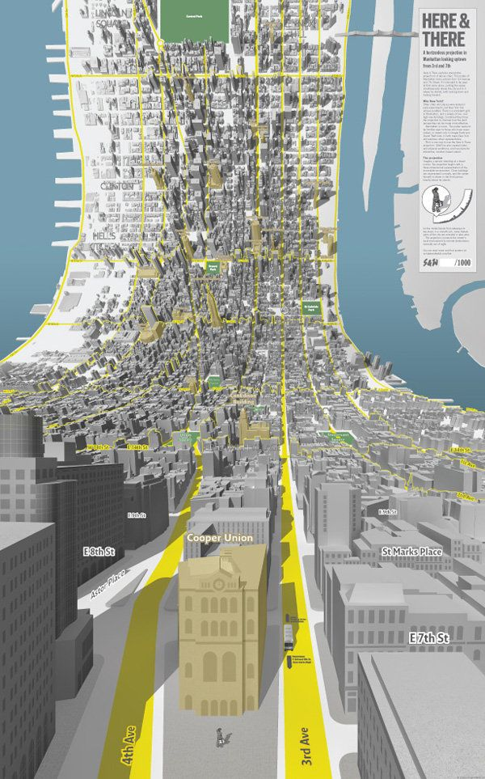
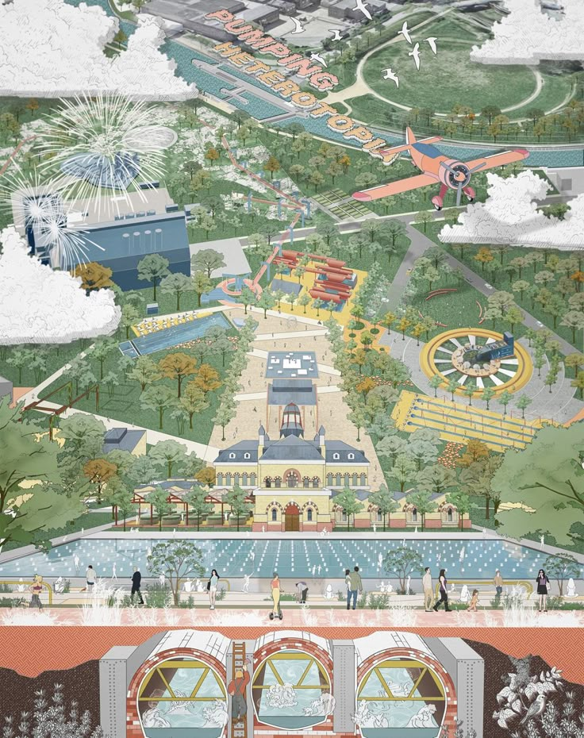
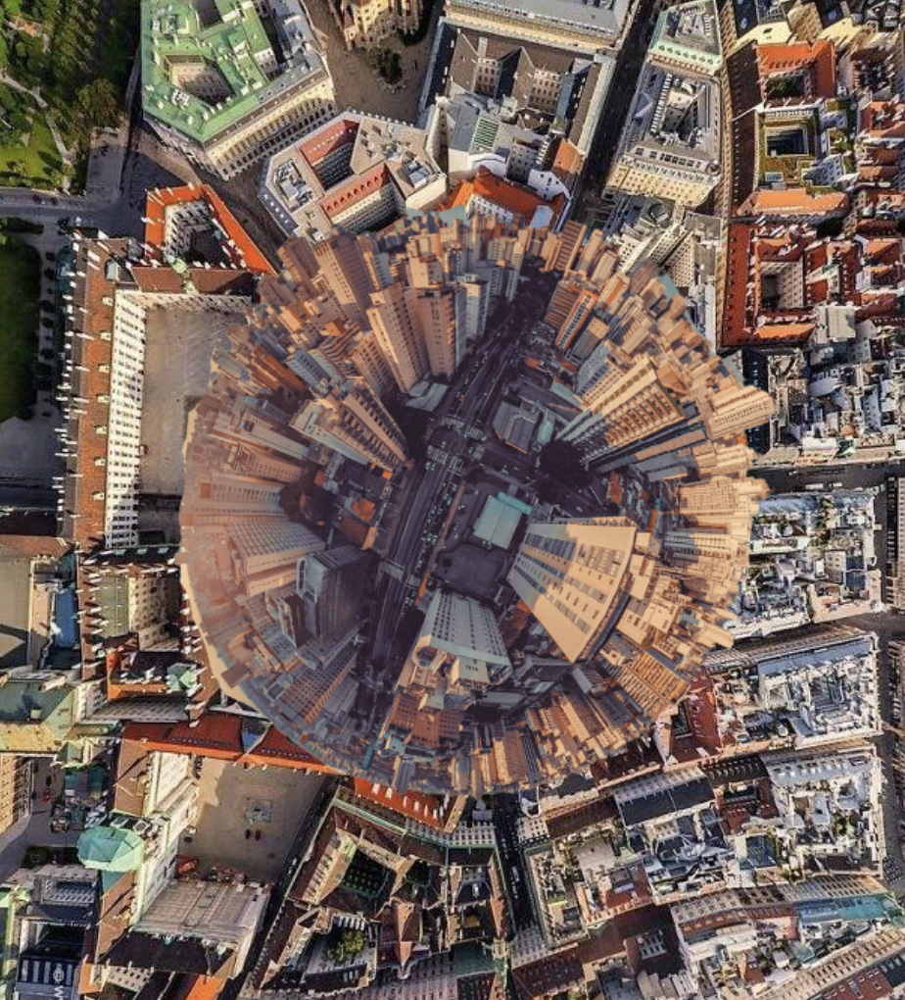
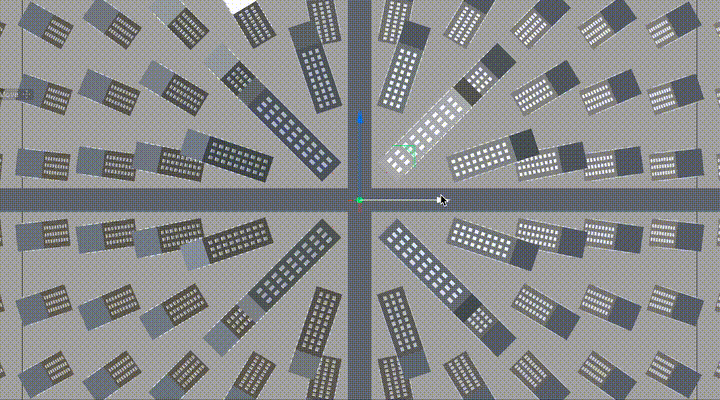

# Task 01.01 - Working With Literature

I looked at Zotero and I found it quite promising. Alternatively would be Notion or Markdown for me.

# Task 01.02 - Topic Brainstorming

- AI-based video generation for 3D renderings
- Hybrid rendering techniques with AI support
- Optimization of 3D animation through generative AI models
- Agent-based AI beyond role-playing
- Creativity techniques for AI reasoning processes
- Psychological methods in AI decision-making processes
- Innovative map projections for navigation
- Non-linear scales in digital cartography
- Multi-perspective maps for improved spatial orientation
- Playable AI games
- Hybrid AI development methods for video games
- Alternative navigation methods beyond visual perception
- Urban planning
- Evaluation of satisfaction in urban spaces
- UI automation through generative models
- Benchmarking AI creativity
- Psychological testing methods for AI systems
- Specialized AI agents for everyday tasks
- Autonomous systems for web-based search tasks
- Low-code/no-code application development with AI support

# **Task 01.03 - Topic Selection**

## AI-based Video Generation for 3D Renderings

**What interests you specifically about this topic?**
I'm particularly interested in the potential of AI technologies to optimize the rendering process for 3D animations. Various approaches could be promising: from generating intermediate frames based on keyframes, to using depth maps and normal maps as control elements for AI, to intelligent completion of partially rendered scenes. I'm also interested in integrating this in 3D software like Blender or Cinema 4D. I already did a project with Philip but for images: https://www.labenz.io/projects/trender

**What other characteristics does the topic have?**

- Combines established 3D rendering techniques with latest AI image generation methods
- Has potential applications in film industry, advertising, and game development
- Promises significant time savings in creating 3D animations
- Could improve accessibility of high-quality 3D content for smaller studios and individuals

**What questions could you ask about this topic?**

- Which AI models are best suited for different types of 3D scenes?
- How accurately can AI maintain consistency between frames, especially with complex movements?
- What quality differences emerge between traditionally rendered and AI-generated frames?
- How can lighting effects and textures be reliably transferred through AI?
- How effective is motion detection masking for selective rendering of changed areas?

**How could you solve these questions?**

- Develop various prototypes testing different approaches to AI integration
- Comparative studies between fully rendered animations and hybrid approaches
- Create benchmark tests for different scenarios (camera movements, object movements, lighting changes)
- User interviews with 3D artists and animators on practicality and workflow integration
- Implement differential frame analysis to create masks for changed regions, allowing for targeted inpainting of only modified areas to further accelerate rendering times while maintaining visual consistency

## Expanding Agent-based AI Reasoning Methods Beyond Role-Playing

**What interests you specifically about this topic?**
I'm particularly interested in how established psychological and creative methods of group work and decision-making can be applied to AI reasoning models. While currently role-playing approaches are mainly used for AI agents, structured methods like Design Thinking, SCAMPER, or Edward de Bono's Six Thinking Hats could potentially lead to qualitatively different or better results.

**What other characteristics does the topic have?**

- Connects AI research with established theories from psychology and creativity research
- Could lead to new paradigms for AI-supported decision processes
- Addresses limitations of current reasoning approaches such as group dynamics effects and cognitive biases
- Has application potential in education, business consulting, and collaborative problem-solving

**What questions could you ask about this topic?**

- Which psychological methods can be most effectively transferred to AI agents?
- How do the results of different methods differ qualitatively from each other?
- What advantages do structured methods offer compared to role-playing approaches?
- How can the quality of results generated through different methods be objectively measured?

**How could you solve these questions?**

- Develop experimental setups in which AI agents apply various methods
- Comparative analysis of outputs from role-play-based versus method-based approaches
- Conduct user studies to evaluate the quality and usefulness of the generated results
- Develop a theoretical framework for classifying AI reasoning methods

## Innovative Map Projections for Navigation Apps

### Example 1

    
    

### Example 2

 
 

_a moving person_

**What interests you specifically about this topic?**
I'm particularly interested in how we can go beyond traditional bird's-eye views in navigation apps to improve spatial perception and orientation. Through novel projection methods, we could combine different scales and perspectives in a single map view, potentially leading to more intuitive navigation and better spatial understanding.

**What other characteristics does the topic have?**

- Combines elements of cartography, 3D computer graphics, and user experience design
- Explores the boundaries between 2D maps and 3D environment representations
- Could significantly improve spatial orientation in complex urban environments
- Has potential applications in augmented reality, autonomous driving, and urban planning

**What questions could you ask about this topic?**

- Which projection methods enable the best balance between overview and detail accuracy?
- How do non-linear scales affect spatial understanding and navigation decisions?
- What cognitive advantages do combined perspectives offer (e.g., horizontal cylinder with frontal view of nearby buildings)?
- How can a non-flat sensor plane be technically and mathematically modeled?

**How could you solve these questions?**

- Develop prototypes of various projection methods for 3D map representations
- Conduct user studies on orientation performance and cognitive load
- Mathematical modeling of non-linear projections and their implementation in rendering engines
- Compare navigation precision and speed between conventional and innovative map projections
