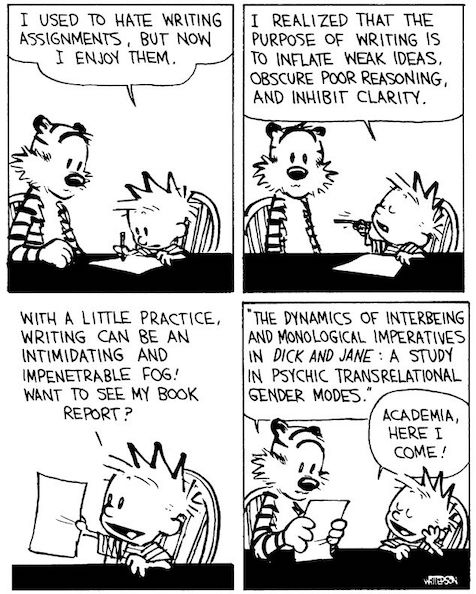

# Academic Methodologies

Prof. Dr. Lena Gieseke \| l.gieseke@filmuniversitaet.de \| Film University Babelsberg KONRAD WOLF

---

# Syllabus

* [Academic Methodologies](#academic-methodologies)
* [Syllabus](#syllabus)
    * [Learning Objectives](#learning-objectives)
    * [Time and Place](#time-and-place)
    * [Method of Instruction](#method-of-instruction)
    * [Schedule](#schedule)
    * [Topics](#topics)
    * [Materials](#materials)
        * [Structure](#structure)
    * [Evaluation](#evaluation)
    * [Grading](#grading)
        * [Criteria](#criteria)
    * [Policies](#policies)
    * [Inclusivity Statement](#inclusivity-statement)
    * [Stress Culture](#stress-culture)

This course enables the participants to understand and to conduct academic research. Academic methodologies are taught by the example of computer science research. Topics include basic principles of scientific research in general, how to conduct certain research tasks in particular and the processes of writing about and publishing work.

As exercise a full conference will be simulated in all its parts, from submitting a paper over reviewing other work to giving a presentation.

## Learning Objectives

* An academic and systematic approach to solve complex problems.
* The presentation of concepts, procedures and results in writing.
* Practical experience in conducting research and publishing a paper.

## Time and Place

* Thursdays, 14.30-16.30, room 6119
    * 9 sessions in total
* 2 SWS, 3 ECTS
    * 1.5 SWS, 1.5 ECTS lectures
    * 0.5 SWS, 1.5 ECTS conference
* The time and place of the conference simulation will be announced shortly.

## Method of Instruction

The class is conducted as lectures. Class attendance is non-mandatory, but there is a grade for participation. If you let me know in advance you can substitute class participation with written homework.
  
The paper, the reviews and exercises are homework.  
  
## Schedule

| Session | Title                 | Topics          |
| ------- | --------------------- | --------------- |
| 10.04.  | Conference Simulation |                 |
|         | Anatomy of a Paper    | Paper Storyline |
|         | Literature            |                 |
| 17.04.  |                       |                 |
| 15.05.  |                       |                 |
| 22.05.  |                       |                 |
| 05.06.  |                       |                 |
| 12.06.  |                       |                 |
| 19.06.  |                       |                 |
| 26.06.  |                       |                 |
| 03.07.  |                       |                 |

## Topics

Possible Topics are:

* Research              
* Reasoning             
* HCI                   
* Experiments           
* Statistics            
* Qualitative Research  
* Academic Publishing   
* Academic Careers      

New: Artistic Research, Media Studies

Please note that all is subject to change!

## Materials

* On Thursday all session materials are published for the following week.
* You hand in all materials through GitHub.

### Structure

Materials are structured as follows:

* In [`Sessions`](01_sessions) you find a [folder](01_sessions/01_research/) with an index for each week (session = week).
    * The [README.md](01_sessions/01_research/README.md) in each session folder gives you an overview of all the readings, assignments, practical exercises, etc. that you have to do for that week - it is your todo list! I recommend to start your work with going through that file.
* In [`Scripts`](02_scripts) you find all scripts.
* In [`Slides`](03_slides) you find all slides.
* In [`Submissions`](04_submissions) you submit your work each week to the folder with your last name and a folder with the session index. You will submit all assignments to the same folder (the one with your last name).

## Evaluation

The requirements to pass the course are

* class participation and / or script summaries,
* a written paper,
* reviews of the assigned papers,
* a conference presentation, and
* participation at the conference discussions.

## Grading

There will be a grade. The grade is computed as follows:

* 15% for participation in class and homework assignments
* 60% for the paper
* 15% for the presentation
* 10% for the reviews

### Criteria

The grading criteria for class participation are quality and quantity.
  
The grading criteria for the paper are based on

* the research idea,
* coherence to an academic format, and
* the form of presentation.

The grading criteria for the review are based on

* suitability and quality of the comments, and
* a reasonable quantity.

The grading criteria for the presentation are based on

* the communication of the research idea,
* a coherence to an academic format, and
* the form of presentation.

## Policies

* **Plagiarism**: You have to follow academic standards for all usage of given text, insights, etc. It is categorically forbidden to outsource work to people outside the course or copy & paste, meaning plagiarize, text without citations. 
* **Tools and utilities**: You are allowed to use any tools you want, also ChatGPT. Please make sure to utilize such tools for supporting your learning, not for just producing a result. 
* **Absences**: you are responsible for what happens in class whether you are here or not. I will not repeat content for you that you have missed because you were not in class.
* **Participation**: you are invited, encouraged, and expected to engage actively in discussion, reflection and activities. Also, you can exist for a few hours without chatting, texting or emailing on your notebook. I will notice if you don't pay attention and prefer that you only come to class if you are actually participating. 
* **Recording**: There are no recordings of the classes. No student may record any classroom activity without express written consent from me. If you have a disability such that you think you need to record or tape classroom activities, get in touch with me.

[*Adapted from P. Pedercini with permission.*]

## Inclusivity Statement

It is my intent that students from all diverse backgrounds and perspectives be well served by this course, and that the diversity that students bring to this class be viewed as a resource, strength and benefit.  

It is my intent to present activities that accommodate and value a diversity of gender, sexuality, disability, age, socioeconomic status, ethnicity, race, and culture. I will gladly honor your request to address you by your preferred name and gender pronoun. I commit to make individual arrangements to address disabilities or religious needs (e.g. religious events in conflict with class meetings and deadlines). Please advise me of these preferences and needs early in the semester so that I may make appropriate changes to my plans and records.  

Debate and free exchange of ideas is encouraged, but I will not tolerate harassment, i.e. a pattern of behavior directed against a particular individual with the intent of humiliating or intimidating.

[*Adapted from P. Pedercini with permission.*]

## Stress Culture

This class is demanding as I want you to further develop your skills, thinking and views of the world. This is hard. Also, as we are an interdisciplinary group, there is probably for each topic someone who you think is doing a much better job than you. Please focus on your own journey and trust the process.
  
Nevertheless, take care of yourself. All of us benefit from support during times of struggle. You are not alone. There are many helpful resources available at Filmuni, and an important part of the university experience is learning how to ask for help. If you or anyone you know experiences any unbearable academic stress, difficult life events, or feelings like anxiety or depression, I strongly encourage you to seek support. The Filmuni offers different [services and counseling](https://www.filmuniversitaet.de/en/university/counseling-services) for you. 

[*Adapted from P. Pedercini with permission.*]